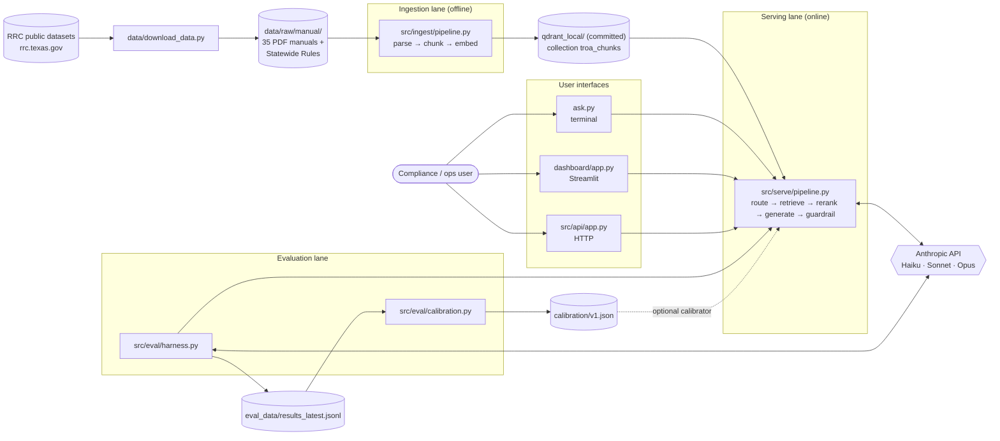
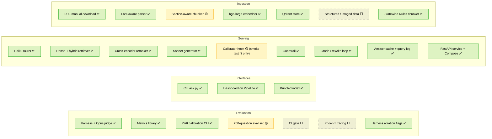
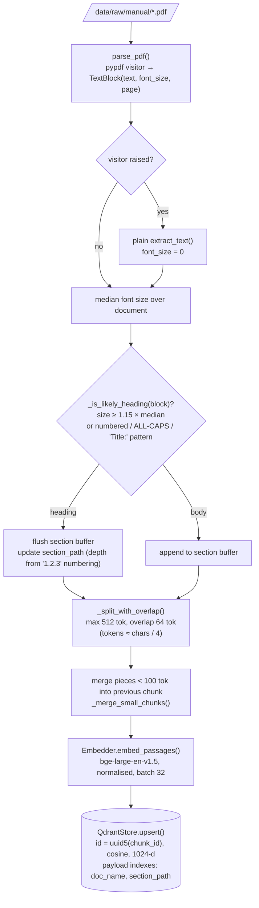
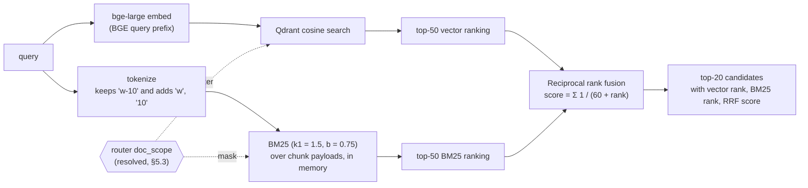
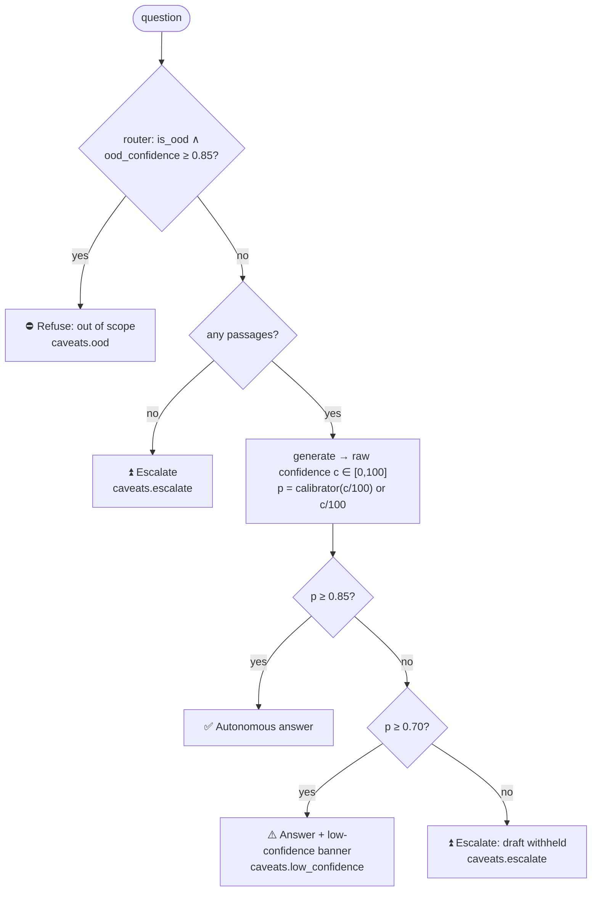
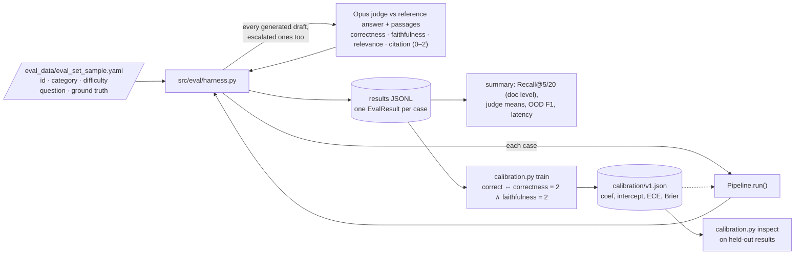
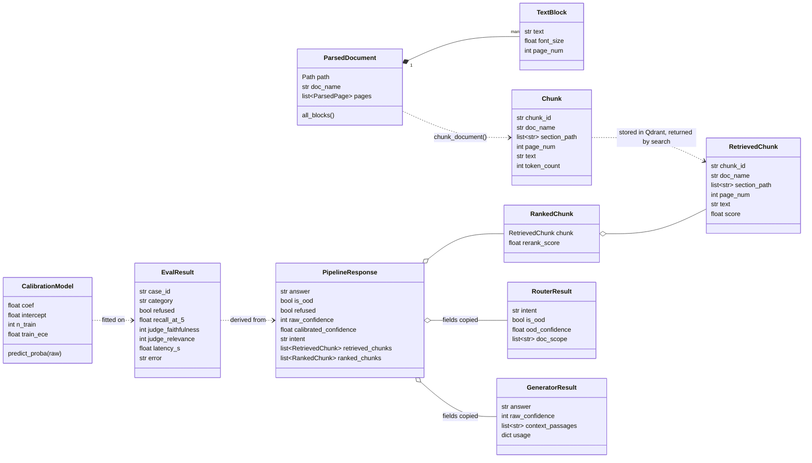

# ARCHITECTURE.md

System design for TROA (Texas Oil and Gas Regulatory Operations Assistant).

TROA is organised in three lanes, **ingestion**, **serving**, and **evaluation**. One serving `Pipeline` answers every question, whether it comes from the terminal CLI (`ask.py`), the Streamlit dashboard, the HTTP API, or the eval harness. The search index is committed (`qdrant_local/`), so a fresh clone can answer questions without ingesting anything.

This document describes the code as it exists in the repository. Every component is marked with an implementation status. Where the code and the original design disagree, both are stated.

| Status | Meaning |
|---|---|
| ✅ Implemented | Code exists and has been exercised end to end. |
| 🟡 Partial | Code exists but is not wired in, not validated, or differs from the design. |
| ⬜ Planned | Described in the design only; no code yet. |

---

## Contents

1. [System overview](#1-system-overview)
2. [Component status](#2-component-status)
3. [Ingestion lane](#3-ingestion-lane)
4. [Serving lane (`src/serve`)](#4-serving-lane-srcserve)
5. [User interfaces and hybrid search](#5-user-interfaces-and-hybrid-search)
6. [Guardrail policy](#6-guardrail-policy)
7. [Evaluation lane](#7-evaluation-lane)
8. [Data model](#8-data-model)
9. [Prompts and model versions](#9-prompts-and-model-versions)
10. [Storage layout](#10-storage-layout)
11. [Design decisions](#11-design-decisions)
12. [Known gaps between design and code](#12-known-gaps-between-design-and-code)

---

## 1. System overview



Every entry point uses the same `Pipeline` and, unless `.env` names another Qdrant, the committed `qdrant_local/` index. Settings come from `.env` through `src/config.py` (`Settings`), with per-run overrides:

| Entry point | Typical use | Settings |
|---|---|---|
| `ask.py` | Ask from the terminal, one question or interactive | `.env`, plus `--hybrid`, `--agentic`, `--rerank` |
| `dashboard/app.py` | Browser UI: streamed answers, sources, trace, corpus stats, quick eval | `.env` defaults, sidebar switches |
| `src/api/app.py` | HTTP service (`/ask`, `/ask/stream`, `/health`) | `.env` |
| `src/eval/harness.py` | Evaluation runs | CLI flags (`--search-mode`, `--agentic`, `--rerank`, `--calibration`) |

Qdrant's local mode allows one process per index folder, so only one of these can use `qdrant_local/` at a time; the API in Docker uses a Qdrant server instead.

---

## 2. Component status



| Component | File(s) | Status | Notes |
|---|---|---|---|
| Corpus download | `data/download_data.py` | ✅ | 37 entries: 36 curated manuals plus the Statewide Rules (16 TAC Chapter 3, effective 12/8/2025). 36 download (the docket manual `oda037k` returns 404). `--include-data` / `--include-all` fetch structured and imaged sets. |
| Parser | `src/ingest/parse.py` | ✅ | `pypdf` visitor API captures per-block font size; falls back to plain text. |
| Chunker | `src/ingest/chunk.py` | 🟡 | Section-aware with merge of small chunks. Small chunks are merged across section boundaries (gap #7). All 8 `chunk_document` tests pass; the two section-tracking tests run with merging disabled (`min_tokens=1`). |
| Statewide Rules chunker | `src/ingest/rules.py` | ✅ | Splits the 16 TAC Chapter 3 PDF by rule (`§3.N`) and top-level subsection, and prefixes each chunk with a `[16 TAC §3.N …, subsection (x)]` header. `src/ingest/pipeline.py` routes any PDF whose name starts with `statewide_rules` here. The 12/8/2025 PDF gives 91 rules and 949 chunks (max 510 tokens). 8 tests in `tests/test_rules.py`. |
| Embedder | `src/ingest/embed.py` | ✅ | `BAAI/bge-large-en-v1.5`, 1024-d, BGE query prefix. |
| Vector store | `src/ingest/store.py` | ✅ | Qdrant, deterministic UUID5 point IDs (idempotent re-ingest). A local-file store with 2,941 points from 36 documents is committed under `qdrant_local/`: 1,992 manual chunks and 949 Statewide Rules chunks, exactly the PDFs `data/download_data.py` fetches. (The 188 chunks of `oda037k_oil_gas_docket`, which no longer downloads, were removed on 2026-10-08.) |
| Router | `src/serve/router.py` | ✅ | Haiku, JSON output: intent, `is_ood`, `ood_confidence`, `doc_scope`. |
| Retriever | `src/serve/retrieve.py`, `hybrid.py` | ✅ | Dense top-20, or hybrid: dense top-50 and BM25 top-50 fused with RRF. Optional `doc_name` filter. |
| Agent loop | `src/serve/agent.py` | ✅ | Optional. Grade → rewrite → retry once; records `retrieval_sufficient`. |
| Reranker | `src/serve/rerank.py` | ✅ | `BAAI/bge-reranker-large` cross-encoder, top-5. Optional: `rerank=False` uses `PassthroughReranker` (top-5 by retrieval score). |
| Generator | `src/serve/generate.py` | ✅ | Cached system prompt, `<confidence>` tag extraction. |
| Calibrator | `src/eval/calibration.py` | 🟡 | Works end to end: the harness judges every draft, `train` fits Platt scaling on the correctness label, and the harness, API and `Pipeline` accept the fitted JSON. The only fit is a 9-example smoke test (`calibration/v0_smoke.json`, git-ignored) that squashes all confidences into 0.25–0.40, so serving still uses raw confidence. `train` warns when there are fewer than 100 examples or none below raw 70. |
| Guardrail | `src/serve/guardrail.py` | ✅ | Three actions plus OOD refusal (see §6). |
| Answer cache, query log | `src/serve/cache.py`, `telemetry.py` | ✅ | Optional. See §4.3. |
| HTTP service | `src/api/app.py`, `src/config.py`, `compose.yml` | ✅ | FastAPI, SSE streaming, Docker Compose with Qdrant and Redis. Not yet load-tested. |
| CLI | `ask.py` | ✅ | One question or interactive; prints decision, answer, confidence, sources. See §5. |
| Dashboard | `dashboard/app.py` | ✅ | Streamlit over the same `Pipeline`. See §5 and [docs/DASHBOARD.md](docs/DASHBOARD.md). |
| Eval harness | `src/eval/harness.py` | ✅ | Runs the pipeline, Opus judge, document-level Recall@5/20 and reranked Recall@5, refusal metrics. Flags for `--search-mode`, `--agentic`, `--calibration`. |
| Eval set | `eval_data/eval_set_sample.yaml` | 🟡 | 12 of 200 planned questions. |
| CI gate, Phoenix | – | ⬜ | Designed in this document; not built. |

---

## 3. Ingestion lane

### 3.1 Sources

| Source | Status | Use |
|---|---|---|
| PDF user manuals (35 downloaded) | ✅ | Primary RAG corpus. Each manual documents one RRC form or dataset: record layouts, field definitions, update cadence, some filing rules. |
| Structured ASCII data (field rules, inspections, UIC, statewide field data) | ⬜ | Downloadable with `--include-data`; not parsed. |
| Imaged W-1 permits | ⬜ | Downloadable with `--include-all`; OCR not implemented. |
| Statewide Rules (16 TAC Chapter 3) | ✅ | Downloaded from RRC's Current Rules page (effective 12/8/2025), chunked by `src/ingest/rules.py`, ingested (949 chunks). |

> **Corpus characteristic that matters for evaluation:** by their titles and descriptions in `data/download_data.py`, most manuals are *data-layout* documents (record formats, field definitions). Questions about *regulatory rules* are often only partially answered by them, which is why the Statewide Rules were added. In the recorded runs (§7.4), adding them changed retrieval for 3 of 9 in-scope questions and raised confidence on 2, but did not change the W-10 deadline question.

### 3.2 Pipeline



PDFs whose filename starts with `statewide_rules` skip the font-size parser and go to `chunk_rules()` in `src/ingest/rules.py`, which splits by rule and subsection (the rules PDF has no usable font-size headings).

Run with `python -m src.ingest.pipeline --corpus data/raw/manual/ --qdrant-path qdrant_local` (no server), or `--qdrant-url` for a running Qdrant. `--dry-run` parses and chunks only. See [docs/WORKFLOWS.md §3](docs/WORKFLOWS.md#3-ingest-the-corpus-into-qdrant).

### 3.3 Chunk identity

`chunk_id = sha1(doc_name | section_path | index)[:16]`, and the Qdrant point ID is `uuid5(NAMESPACE_DNS, chunk_id)`. Re-ingesting an unchanged document overwrites its points rather than duplicating them. Changing chunking parameters changes IDs, so a full re-ingest should start from an empty collection.

### 3.4 Design rationale

- **Section-aware rather than fixed-window chunking.** Regulatory manuals have strong section semantics, and a chunk that straddles two record layouts confuses both retrieval and citation. The original design notes a +11 point Recall@5 gain on a 50-question pilot. That pilot is not reproducible from the repository yet.
- **`bge-large-en-v1.5`.** MIT licence, strong retrieval benchmarks, 1024-d. `e5-large-v2` was the alternative considered.
- **Qdrant.** Fast payload filtering for router document scoping, trivial local mode (`path=`), Apache 2.0, self-hostable.

---

## 4. Serving lane (`src/serve`)

### 4.1 Request flow

```mermaid
sequenceDiagram
    autonumber
    actor U as Caller
    participant P as Pipeline.run()
    participant R as Router (Haiku)
    participant E as Embedder (bge-large)
    participant Q as Qdrant
    participant X as Reranker (bge-reranker-large)
    participant G as Generator (Sonnet)
    participant C as Calibrator (optional)

    U->>P: question
    P->>R: route(question)
    R-->>P: intent, is_ood, ood_confidence, doc_scope
    alt is_ood and ood_confidence ≥ 0.85
        P-->>U: OOD refusal (caveats.yaml: ood)
    else in scope
        P->>E: embed_query(BGE prefix + question)
        E-->>P: 1024-d vector
        P->>P: resolve_scope(doc_scope, stored doc_names)
        P->>Q: search top-20, vector or hybrid (filter doc_name ∈ resolved scope; whole corpus if empty)
        Q-->>P: 20 candidates
        P->>X: rerank(question, candidates)
        X-->>P: top-5
        opt agentic
            P->>P: grade (Haiku). If insufficient: rewrite, search again,<br/>pool candidates, rerank against the original question, grade again
        end
        alt no ranked chunks
            P-->>U: escalate (caveats.yaml: escalate)
        else
            P->>G: generate(question, top-5)
            G-->>P: answer + raw_confidence 0–100
            opt calibrator supplied
                P->>C: predict_proba(raw 0–100)
                C-->>P: calibrated probability
            end
            P->>P: guardrail (§6)
            P-->>U: PipelineResponse
        end
    end
```

### 4.2 Components

**Router** (`router.py`, prompt `router_v1.yaml`, `claude-haiku-4-5-20251001`). Classifies intent as `lookup | procedural | definitional | synthesis | ood` and estimates OOD confidence. When the question names a form or dataset, it proposes a `doc_scope`. If the router's JSON cannot be parsed, it falls back to `lookup`, not OOD. A router failure therefore never causes a refusal.

**Retriever** (`retrieve.py`). In `vector` mode (the default), dense cosine search over `troa_chunks`, top-20. In `hybrid` mode, dense top-50 and BM25 top-50 are fused with reciprocal rank fusion (`hybrid.py`, shared with the dashboard) and cut to top-20. The BM25 index is built in memory from the chunk payloads already in Qdrant on first use, so hybrid needs no re-ingestion. Both modes apply a `MatchAny` filter on `doc_name` when the router's scope resolves to stored documents. `scope.py` (`resolve_scope`) normalises the router's loose names and the stored `doc_name`s to lowercase alphanumerics and matches by substring, so "W-10" matches `ola001k_oil_well_status_w10`. The stored names come from `Retriever.doc_names()`, scanned once and cached. If no name resolves, or the scoped search returns nothing, the pipeline searches the whole corpus. The dashboard engine uses the same `resolve_scope` (§5.3).

**Agent loop** (`agent.py`, prompts `grader_v1.yaml` and `rewrite_v1.yaml`, Haiku; off by default). A grader judges whether the top-5 passages can answer the question. If not, a rewriter reformulates the query for the manuals' vocabulary and the pipeline searches once more. The new candidates are pooled with the first set and reranked against the *original* question, so a rewrite can add evidence but never change what is being answered. The grader then runs again, and its final verdict is stored as `retrieval_sufficient`, a retrieval-confidence signal for future calibration features. There is only one retry: if retrieval is still weak, the guardrail decides. An API error in the loop is logged and the pipeline continues without it.

**Reranker** (`rerank.py`). Cross-encoder over (question, passage) pairs; returns the top 5. The design also envisages using the top rerank score as a retrieval-confidence signal for the calibrator. It is recorded in the query log but not yet used by the calibrator.

The reranker is optional and **off by default** (turn it on with `Pipeline(rerank=True)`, harness or `ask.py` `--rerank`, or `TROA_RERANK=true`). When off, `PassthroughReranker` keeps the top 5 candidates by retrieval score (cosine in vector mode, RRF in hybrid mode), so `rerank_score` holds that score, the `rerank` trace stage is marked "off", and the cache key changes. After an agent retry the pooled candidates carry scores from two different queries, so their order is approximate. The cross-encoder model is then never loaded, which avoids its 2.24 GB download.

**Generator** (`generate.py`, prompt `generate_v1.yaml`, `claude-sonnet-4-6`). `generate()` blocks; `stream()` yields text deltas and parses the result at the end. The system prompt is sent with `cache_control: ephemeral` so repeated calls reuse the prompt cache. The model must cite passages as `[N]` and end with `<confidence>0-100</confidence>`. A missing tag yields a confidence of 50, and values are clamped to [0, 100].

**Calibrator** (optional constructor argument). When supplied, the pipeline calls `calibrator.predict_proba(raw_0_to_100)` and uses element `[0]` as the calibrated probability. `CalibrationModel` from `src/eval/calibration.py` has exactly this method, so a loaded model can be passed in directly (see [docs/WORKFLOWS.md §6](docs/WORKFLOWS.md#6-fit-and-apply-the-calibrator)). Without one, confidence is `raw / 100`.

### 4.3 Answer cache, query log, and HTTP service

Adapted from [jamwithai/production-agentic-rag-course](https://github.com/jamwithai/production-agentic-rag-course) and fitted to TROA's guardrail. All three are optional constructor arguments of `Pipeline`, and `src/config.py` builds them from `.env` for the API.

| Feature | Where | Behaviour |
|---|---|---|
| Answer cache | `cache.py` | Exact match on the normalised question. The key also covers prompt file contents, guardrail thresholds, calibrator parameters, models, search settings, and a corpus fingerprint, so a prompt edit, refit, or re-ingest never serves a stale answer (restart the process after either; versions are computed once). Only `autonomous` and `caveat` answers are cached; escalations and refusals are always recomputed. Redis when `REDIS_URL` is set, otherwise in-process with TTL; Redis errors fall back to memory. |
| Per-stage trace | `telemetry.py` | Every `PipelineResponse.trace` lists route, retrieve, rerank, grade/rewrite (if on), and generate with timings and details. |
| Query log | `telemetry.py` | With `query_log=<path>` (`TROA_QUERY_LOG`), one JSON line per question: decision, confidences, ranked sources with vector/BM25 ranks and rerank scores, agent steps, usage, latency, trace, settings, and versions. This is the data for calibration refits and for mining escalations into new eval questions. |
| HTTP service | `src/api/app.py` | `GET /health`, `POST /ask` (full response with citations), `POST /ask/stream` (SSE: `meta`, `token`…, `final`). Streamed tokens are the generator's draft with the `<confidence>` tag hidden; the guardrail runs afterwards, so clients must show `final.answer`. |
| Containers | `Dockerfile`, `compose.yml` | Qdrant (pinned to the client version), Redis, and the API. |

---

## 5. User interfaces and hybrid search

### 5.1 CLI and dashboard

`ask.py` builds a `Pipeline` with `src.config.build_pipeline()` and prints the guardrail decision, the answer (the escalation notice when withheld), the confidence, and one line per source (document, page, section). It switches stdout to UTF-8 so the decision icons print on Windows consoles.

`dashboard/app.py` builds the heavy components once (`st.cache_resource`): the `Retriever`, the `Embedder` (loaded at start-up, behind a spinner), the `Reranker` (its model loads only if reranking is switched on), the router, generator, grader and rewriter. Each combination of sidebar switches gets a cheap `Pipeline` that reuses them, which matters because Qdrant's local mode allows one client per index folder. Answers stream through `Pipeline.stream()`; the streamed text is the draft, and the final event replaces it with the guardrail's answer. On escalation the withheld draft (`draft_answer`) is shown in an expander. The Corpus tab reads per-document statistics from the index (`Retriever.doc_stats()`); the Evaluation tab runs the eval set without the judge and lists saved harness runs. Usage is in [docs/DASHBOARD.md](docs/DASHBOARD.md).

Until 2026-10-08 the dashboard ran its own in-memory engine (`dashboard/engine.py`: `bge-small`, fixed 800-character chunks, no reranker), so its answers differed from the API's and the harness's. It was replaced by the shared `Pipeline` and removed, together with `mvp_rag.py`.

### 5.2 Hybrid retrieval



- **Why hybrid:** RRC questions hinge on exact identifiers (`W-10`, `G-10`, `P-5`, `OGA049`) that dense models blur together. BM25 recovers exact matches, and RRF combines the two rankings without having to normalise their incompatible score scales.
- **Modes:** `vector` (the default) and `hybrid` (`--hybrid`, `TROA_SEARCH_MODE=hybrid`, or the dashboard switch).
- **Scope:** if the router names a document and it resolves, both rankings are restricted to it. If the scoped search finds nothing, the whole corpus is searched.

### 5.3 Router scope resolution

The router returns loose names such as `["W-10"]` or `["P-5"]`. Both sides are normalised to lowercase alphanumerics (`W-10` → `w10`) and matched by substring against the stored document names (`src/serve/scope.py`). For example, `w10` matches `ola001k_oil_well_status_w10`. Names shorter than 2 characters are ignored.

---

## 6. Guardrail policy

Defined once in `src/serve/guardrail.py` (`THRESHOLD_AUTONOMOUS`, `THRESHOLD_CAVEAT`, `OOD_CUTOFF`, `decide()`, `is_ood_refusal()`) and applied in `src/serve/pipeline.py`, so every interface uses the same policy:



**Design vs implementation.** `EVALUATION.md` specifies a four-band policy (≥ 0.85 autonomous, 0.65–0.85 caveat, 0.45–0.65 "verify with compliance officer", < 0.45 refuse) derived from a cost model with roughly a 10:1 ratio of wrong-answer cost to delay cost. The code implements a stricter **three-band** policy with a single 0.70 cut-off. Without a fitted calibrator, *p* is the model's raw self-reported confidence, so the thresholds are not yet calibrated decisions. Reconciling the two is planned once a calibrator has been fitted.

---

## 7. Evaluation lane

### 7.1 Flow



### 7.2 Metrics

The metrics library (`src/eval/metrics.py`) implements Recall@k, Precision@k, MRR, Cohen's κ for judge validation, ECE, and refusal metrics (OOD refusal rate, in-scope refusal rate, OOD F1). Definitions and targets are in [EVALUATION.md](EVALUATION.md).

Ground truth in the current eval set is **document-level** (`document` + `section` name, no chunk IDs). The harness and dashboard therefore compute retrieval metrics at the manual level: a hit means any passage from a ground-truth manual appears in the top-k. This is more lenient than the chunk-level metric `EVALUATION.md` describes.

### 7.3 Judge

The judge model is `claude-opus-4-7` (`src/eval/harness.py`, `JUDGE_MODEL`). The rubric is `JUDGE_RUBRIC` in `src/eval/metrics.py`; the docstring there refers to a `judge_v2.yaml` that does not exist. The judge sees the question, the eval set's `ground_truth_answer`, the top-5 passages, and the generator's **draft** (`PipelineResponse.draft_answer`), so escalated answers are scored too. It returns four 0–2 scores: correctness against the reference answer, and faithfulness, relevance and citation accuracy against the passages. The calibration label is `correctness == 2 and faithfulness == 2` (`JudgeScore.correct()`). Judge validation against human labels (κ ≥ 0.6) is implemented as a function, but no human labels exist yet.

### 7.4 Latest results

| Run | Engine | n | Hit@5 (doc) | MRR (doc) | OOD refusal | In-scope refusal |
|---|---|---|---|---|---|---|
| `eval_data/results_latest.jsonl` | `src/serve` | 12 | – | – | – | – |
| `eval_data/results_verify_norerank.jsonl`, 2026-10-08 | `src/serve`, vector, **no reranker**, no agent, no judge, `claude-sonnet-4-6` | 12 | 0.78 (Recall@5) | – (harness does not report MRR) | 1.00 (3/3) | 0.56 (5/9) |
| `eval_data/results_verify_norerank_rules.jsonl`, 2026-10-08 | Same, with the Statewide Rules indexed | 12 | 0.67 (Recall@5; ground truth does not list the rules) | – | 1.00 (3/3) | 0.44 (4/9) |
| Dashboard, 2026-10-08 (**unverified**, output not saved) | former `dashboard/engine.py` (removed), hybrid, agentic, `claude-sonnet-4-6` | 12 | 0.67 | 0.58 | 1.00 (3/3) | 0.56 (5/9) |
| Target (`EVALUATION.md`) | | | ≥ 0.85 | ≥ 0.55 | ≥ 0.95 | ≤ 0.10 |

All 12 cases in `results_latest.jsonl` failed with `401 invalid x-api-key`, so that file contains no usable metrics. The dashboard row was reported from an interactive session whose JSONL was not saved, so it cannot be checked; even if reproduced, 12 questions give direction only. The first verifiable result will be a harness run committed with its output (README, Next steps 1–2).

---

## 8. Data model



Qdrant payload per point: `chunk_id`, `doc_name`, `section_path`, `page_num`, `text`, `token_count`. Payload indexes exist on `doc_name` and `section_path`.

---

## 9. Prompts and model versions

All prompts are YAML in `src/serve/prompts/`. They are versioned by filename, and each file pins its own model.

| File | Used by | Model | Output contract |
|---|---|---|---|
| `router_v1.yaml` | `src/serve/router.py` | `claude-haiku-4-5-20251001` | One JSON object: `intent`, `is_ood`, `ood_confidence`, `doc_scope` |
| `generate_v1.yaml` | `src/serve/generate.py` | `claude-sonnet-4-6` | Answer with `[N]` citations, then `<confidence>0–100</confidence>` |
| `grader_v1.yaml` | `src/serve/agent.py` | `claude-haiku-4-5-20251001` | JSON: `relevant`, `sufficient`, `reason` |
| `rewrite_v1.yaml` | `src/serve/agent.py` | `claude-haiku-4-5-20251001` | A single rewritten query string |
| `caveats.yaml` | guardrail (`src/serve/pipeline.py`) | – | Text for `low_confidence`, `escalate`, `ood` |
| `JUDGE_RUBRIC` (in `src/eval/metrics.py`) | harness | `claude-opus-4-7` | JSON: `correctness`, `faithfulness`, `relevance`, `citation_accuracy`, `rationale` |

**Changing a prompt:** add a new versioned file rather than editing in place, then point the caller at it and re-run the eval. See [docs/WORKFLOWS.md §7](docs/WORKFLOWS.md#7-change-a-prompt-or-model).

---

## 10. Storage layout

| Path | Contents | In git |
|---|---|---|
| `data/raw/manual/` | Downloaded PDF manuals | No (`.gitignore`) |
| `qdrant_local/` | Bundled search index: collection `troa_chunks`, 2,941 points, 1024-d, 36 documents | Yes |
| `eval_data/` | Eval set YAML, latest harness results | Yes |
| `calibration/` | Fitted calibrators (`*.json` ignored, `.gitkeep` kept) | Directory not created yet |
| `logs/` | Query logs (`TROA_QUERY_LOG`) | No |
| `.env` | `ANTHROPIC_API_KEY` | No |

---

## 11. Design decisions

- **Haiku for routing, grading, and rewriting; Sonnet for answers; Opus for judging.** Small models handle the cheap classification steps. A different model family member for the judge keeps evaluation independent of the generator.
- **Cross-encoder reranker rather than an LLM reranker** in `src/serve`. Faster and cheaper; less flexible if reranking ever needs reasoning.
- **Hybrid search before the reranker, not instead of it.** The original design deferred BM25 to v2 after a pilot that reported +2 points Recall@20 on multi-doc synthesis. It is now available in both lanes because exact form identifiers dominate RRC queries. In `src/serve` it feeds the cross-encoder, and BM25 runs in-process over Qdrant payloads (a few thousand chunks) instead of in a second search engine. It is off by default until `python -m src.eval.harness --search-mode hybrid` shows a gain.
- **A bundled index.** `qdrant_local/` (about 37 MB) is committed so a clone can answer questions immediately; rebuilding it is documented for when RRC updates its documents.
- **New serving features default to off.** Hybrid search, the agent loop, the cache, and the query log are all opt-in, so the harness baseline stays comparable and each one is adopted only on eval evidence.
- **The reranker is off by default.** It is a 2.24 GB download that failed repeatedly on a slow connection, and it has not been shown to help on the eval set. `python tasks.py eval-ablation` includes a `--rerank` run to decide it. Whether it helps TROA has not been measured; comparing `recall_at_5` with `ranked_recall_at_5`, or a `--no-rerank` run against the baseline, decides it.
- **One agentic retry, not an open loop.** Bounded latency and cost, and a deterministic trace. The guardrail, not the agent, decides whether to answer. In `src/serve` the rewrite is used only for retrieval; reranking and generation use the user's question.
- **Self-reported confidence plus Platt scaling.** The cheapest confidence signal (one extra tag in the same call), made trustworthy by calibration on labelled outcomes. Calibration is aggregate, not per category, because 200 questions is too few for per-category fits.
- **No fine-tuning in v1.** Poor cost-to-improvement ratio without a feedback loop.

---

## 12. Known gaps between design and code

| # | Design / docs say | Code does | Impact |
|---|---|---|---|
| 1 | OOD short-circuit at router confidence ≥ 0.7 | ≥ 0.85 (`OOD_CUTOFF` in `guardrail.py`) | Fewer refusals of borderline queries |
| 2 | Four-band threshold policy (`EVALUATION.md`) | Three bands, 0.85 / 0.70 | Stricter escalation |
| 3 | Calibrated confidence drives the guardrail | No calibrator fitted yet | Guardrail acts on raw self-reported confidence |
| 5 | Prompt `generate_v3.yaml`, judge `judge_v2.yaml` | `generate_v1.yaml`; judge rubric inline in `metrics.py` | Documentation only |
| 6 | Chunk-level retrieval ground truth | Document-level ground truth | Recall is measured per manual |
| 7 | Short sections stay separate chunks | `_merge_small_chunks` merges any chunk under `min_tokens` (default 100) into the next one, across section boundaries. Tests now disable merging to check section tracking; no test asserts the merge behaviour itself | Mixed-section chunks; section path of the first section only |
| 8 | Reranker score feeds calibration | Rerank scores and the grader's `retrieval_sufficient` are logged; the calibrator uses generator confidence only | – |
| 9 | CI gate, Phoenix traces | Not implemented. FastAPI (`/ask`, not `/answer`), Docker Compose, and JSONL query logs are built | Planned |
| 10 | Eval ground truth covers the whole corpus | `ground_truth_chunks` lists manuals only, never the Statewide Rules | A retrieved rule passage counts as a miss even when it is the governing rule (README, second run) |
| 11 | Dependencies match the code | `requirements.txt` lists `openai`, `unstructured[pdf]`, `pytesseract`, `Pillow`, `pyarrow`, `ragas`, `arize-phoenix`, `structlog`, none of which is imported; the `Dockerfile` installs `tesseract-ocr` and `poppler-utils`, also unused | Larger install and image; no functional effect |

**Resolved 2026-10-08 (later).** `_split_with_overlap` in `chunk.py` could loop forever when the overlap was at least as large as the window: `start` stopped advancing and the chunk list grew until memory ran out. `chunk_rules()` can reach that case, because it shrinks its token budget toward 64 while the default overlap is 64 tokens. On 2026-10-08, minutes after `rules.py` was last edited, a Python process reached 53.7 GB of virtual memory and the machine became unresponsive (Windows Resource-Exhaustion-Detector event). This loop is the most likely cause; the exact command that was running was not recorded. The overlap is now capped below the window size. Separately, the two failing `chunk_document` tests were updated to disable merging (gap #7), so the suite passed (63 tests at the time).

**Resolved 2026-10-08 (judge and calibrator hook).** Three defects kept the calibrator from ever being trainable. (1) `JUDGE_RUBRIC` contained literal JSON braces, so `str.format()` raised `KeyError('"faithfulness"')` and every judged case errored; this dated from the initial commit, and earlier runs never reached the judge. (2) The harness judged only answers the guardrail released, and the pipeline discarded the draft on escalation, so no answer below raw confidence 70 could enter the training data. `PipelineResponse.draft_answer` now keeps the draft (not exposed by the API), and `judge_target()` sends every generated in-scope draft to the judge. (3) The label `faithfulness == 2 and relevance >= 1` counted honest "the sources don't say" answers as correct: in the first judged run all 9 drafts were "correct", including two with confidence 2. The judge now also scores correctness against `ground_truth_answer`, and the label is `correctness == 2 and faithfulness == 2` (3 of 9 correct in the same setting).

**Resolved 2026-10-08 (Statewide Rules).** Capping the overlap just below the window stopped the hang but not the damage: on the real rules PDF, `chunk_rules()` shrank its budget until the window crept forward one word at a time, producing 128,531 near-duplicate chunks (1,459 for Rule 37 alone). The cause was a mismatch between the word-count estimate in `_split_with_overlap` and the character-based `_count_tokens`, which legal text with long words always failed. `rules.py` now splits with `split_by_tokens()`, which measures characters directly, so each piece fits on the first pass, and caps the overlap at half a piece (949 chunks, 15 for Rule 37). `_split_with_overlap` now caps the overlap at half the window; this only affects windows under about 80 tokens, so the main corpus still chunks to the same 1,992 chunks. The rules PDF was then added to the downloader and to `src/ingest/pipeline.py`, with 8 tests (73 in total).

**Resolved 2026-10-08.** `Pipeline` now calls `predict_proba()`, so `CalibrationModel` plugs in without an adapter. Router scope is resolved with `scope.py` instead of exact `doc_name` matching. `calibration.py train` reads the harness's `judge_faithfulness` / `judge_relevance` fields directly. The harness accepts `--calibration`.
