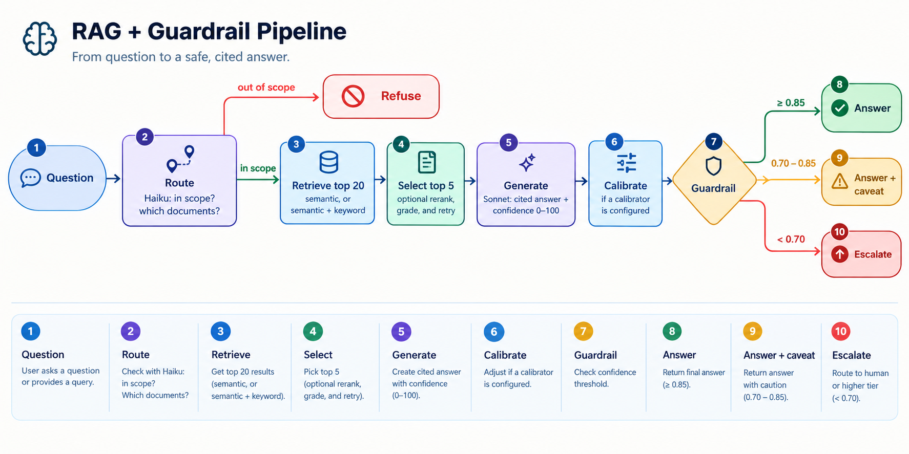

# TROA

**Texas Oil and Gas Regulatory Operations Assistant.** Ask questions in plain English about the Railroad Commission of Texas (RRC) oil and gas manuals and Statewide Rules. TROA answers from the source documents, cites the passages it used, and withholds answers it isn't confident in.

```
$ python ask.py "What does the Drilling Permit Master dataset contain?"

✅ Autonomous answer  ·  confidence 0.88  ·  13.5s

Based on the provided context passages, the Drilling Permit Master dataset
contains the following:

**General Permit Information** (applied for on Form W-1) [1][2]:
- Permit number
- Date issued
…

Sources:
  [1] oga049m_drilling_permit_master_latlong, page 3: …
  [2] oga049_drilling_permit_master, page 3: …
```

*Output from a fresh-clone test on 2026-10-08, shortened.*

> [!WARNING]
> TROA is a research project, not a compliance tool. In its first judged evaluation, 3 of 9 in-scope answers were fully correct. Always check an answer against its cited source before you rely on it.

## Contents

- [Why TROA](#why-troa)
- [Quick start](#quick-start)
- [Use TROA](#use-troa)
- [How it works](#how-it-works)
- [Results](#results)
- [Roadmap](#roadmap)
- [Develop](#develop)
- [Reference](#reference)
- [Limitations](#limitations)
- [License](#license)

## Why TROA

RRC publishes its oil and gas guidance as dozens of separate PDF manuals, one for each form or dataset, plus the Statewide Rules. Answering a question such as "What's the deadline for filing a W-10?" means finding the right document and then the right page.

A general-purpose chatbot is a poor fit for this, for two reasons:

- **Regulatory answers must be traceable.** An answer is only useful if you can check it against the source page. TROA cites every passage it uses.
- **A wrong answer costs more than no answer.** TROA scores its confidence in each answer and withholds answers that fall below a threshold, sending you to an authoritative source instead.

## Quick start

### Before you begin

- Python 3.12
- Git
- An [Anthropic API key](https://console.anthropic.com/) with credits

The search index is included in the repository, so you don't need to download or process any documents before asking a question.

### Install

1. Clone the repository and create a virtual environment:

   ```bash
   git clone https://github.com/drealchux/troa.git
   cd troa
   python -m venv .venv
   source .venv/bin/activate        # Windows PowerShell: .venv\Scripts\Activate.ps1
   ```

   On Windows, clone to a short path such as `C:\troa`. Some PyTorch files are deeply nested and can exceed the Windows 260-character path limit.

2. Install the dependencies:

   ```bash
   pip install -r requirements.txt
   ```

   On Linux without a GPU, first run `pip install torch~=2.14.1 --index-url https://download.pytorch.org/whl/cpu`. Otherwise pip downloads the much larger CUDA build.

3. Add your API key:

   ```bash
   cp .env.example .env
   ```

   Open `.env` and set `ANTHROPIC_API_KEY`.

In a fresh-clone test on Windows 11 (2026-10-08), the install took about 4 minutes and the environment used 1.5 GB.

### Ask your first question

In the terminal:

```bash
python ask.py "What does the Drilling Permit Master dataset contain?"
python ask.py                      # interactive mode; enter a blank line to quit
```

Or in the browser:

```bash
streamlit run dashboard/app.py     # opens http://localhost:8501
```

The first question downloads the embedding model (`bge-large-en-v1.5`, 1.34 GB). Later runs load it from disk.

> [!NOTE]
> Only one program can open the bundled index at a time. Close `ask.py` before you start the dashboard, and vice versa.

If something goes wrong, see [Troubleshooting](docs/WORKFLOWS.md#10-troubleshooting).

## Use TROA

### What TROA knows

| Source | Coverage |
|---|---|
| 35 RRC oil and gas manuals | Data layouts and procedures for forms and datasets such as drilling permits (W-1), well status (W-10, G-10), organization reports (P-5), production, and well records |
| Statewide Rules, 16 TAC Chapter 3 | The Oil and Gas Division's 91 rules, as published effective 12/8/2025 |

TROA doesn't know other RRC chapters, docket decisions, field-specific rules, or anything published after these documents. It refuses questions that aren't about Texas oil and gas regulation.

### Read an answer

Every answer comes with a decision, a confidence score from 0 to 1, and a list of sources (document, page, and section). The `[N]` markers in the answer refer to the numbered sources.

| Decision | When | What to do |
|---|---|---|
| ✅ Autonomous answer | Confidence is 0.85 or higher | Check the cited pages before you rely on it. |
| ⚠️ Answer with caveat | Confidence is from 0.70 to 0.85 | Treat it as a draft and verify it against the sources. |
| ⏫ Escalate | Confidence is below 0.70, or nothing relevant was found. The answer is withheld. | Consult [rrc.texas.gov](https://www.rrc.texas.gov/) or a compliance specialist. The dashboard shows the withheld draft. |
| ⛔ Refuse | The question isn't about RRC oil and gas regulation | Rephrase the question if it is in scope. |

The confidence score is the model's own rating and hasn't yet been calibrated against measured accuracy. A high score is not a guarantee.

### Options

| Flag | Effect |
|---|---|
| `--hybrid` | Adds keyword search. Helps with exact identifiers such as `W-10` and `P-5`. |
| `--agentic` | Grades the retrieved passages and, if they can't answer the question, retries once with a rewritten query. |
| `--rerank` | Reorders passages with a cross-encoder model. Requires a 2.24 GB download. Off by default, because it hasn't yet been shown to improve results. |

The dashboard sidebar has the same options. To change the defaults, edit `.env` (see `.env.example`).

### Cost and speed

Each question makes two Claude API calls: a Haiku call to route the question and a Sonnet call to answer it. `--agentic` adds up to three short Haiku calls. In testing, a typical answer used 1,878 input tokens and 282 output tokens on Sonnet; see [Anthropic pricing](https://www.anthropic.com/pricing).

On a CPU-only laptop, in-scope answers took 5–15 seconds. Refusals took about 1 second.

### Keep the documents current

RRC amends the Statewide Rules periodically and publishes each version at a new URL. To rebuild the index from the latest documents, see [Download the corpus](docs/WORKFLOWS.md#2-download-the-corpus) and [Ingest the corpus](docs/WORKFLOWS.md#3-ingest-the-corpus-into-qdrant).

## How it works

TROA is a retrieval-augmented generation (RAG) system: it retrieves relevant passages from the documents, then has a language model answer from those passages only.



The system has three parts:

- **Ingestion (offline).** Downloads the RRC documents, splits the manuals into sections and the Statewide Rules into rules and subsections, embeds each chunk, and stores the result in a Qdrant index. That index is committed as `qdrant_local/`.
- **Serving (online).** Routes the question, retrieves passages, generates a cited answer with a confidence score, and applies the guardrail. A single `Pipeline` class serves the CLI, the dashboard, the HTTP API, and the evaluation harness, so all four give the same answers.
- **Evaluation.** Runs a set of questions through the pipeline, scores retrieval and refusals, has Claude Opus judge each answer against a reference answer, and fits a calibrator to the judged results.

For the full design, see [ARCHITECTURE.md](ARCHITECTURE.md).

### Technology choices

| Component | Choice | Rationale |
|---|---|---|
| PDF parsing | `pypdf` | Reports the font size of each text run. Headings in the manuals are usually larger than body text, so font size is the main signal for section boundaries. |
| Chunking | Section-aware, up to 512 tokens with 64-token overlap. Statewide Rules are split by rule and subsection, with a `[16 TAC §3.N …]` header on each chunk. | A chunk that spans two sections confuses both retrieval and citation (a design assumption, not yet measured). The header puts the rule name in every chunk. |
| Embeddings | `BAAI/bge-large-en-v1.5` (1024 dimensions, MIT license) | Open, runs on CPU, and embeds both the index and the questions. |
| Vector store | Qdrant 1.19 | Local-file mode needs no server, which lets the index ship with the repository. Payload filters let the router restrict a search to specific documents. The same client also works with a Qdrant server. |
| Keyword search | In-memory BM25, merged with semantic results by reciprocal rank fusion | RRC questions often hinge on exact identifiers such as `W-10` and `OGA049`, which embeddings can blur. At 2,941 chunks, BM25 fits in memory. |
| Reranker | `BAAI/bge-reranker-large`, off by default | Cheaper and faster than LLM reranking. Opt-in until the evaluation shows it helps. |
| Language models | Claude Haiku 4.5 (routing, grading, query rewriting), Sonnet 4.6 (answers), Opus 4.7 (judging) | A small model for cheap classification, a larger one for answers, and a different model as judge so the generator doesn't grade itself. System prompts use prompt caching. |
| Confidence | Self-reported score in the answer call, then Platt scaling | The cheapest available signal, because it needs no extra call. Raw self-ratings aren't reliable on their own, so the design includes a calibrator fitted to judged results. |
| Interfaces | CLI, Streamlit dashboard, FastAPI service | All three call the same `Pipeline`. The API streams answers with server-sent events and documents itself at `/docs`. |
| Answer cache | Redis if `REDIS_URL` is set; otherwise in memory | Optional. Caches only released answers. Falls back to memory on any Redis error. |

## Results

All runs below used 12 evaluation questions (9 in scope, 3 out of scope), vector search, and no reranker. For per-question results, commands to reproduce every figure, and a run that can't be verified, see [docs/RESULTS.md](docs/RESULTS.md).

| Metric | Result | Target |
|---|---|---|
| Out-of-scope questions refused | 3 of 3 | ≥ 95% ✅ |
| In-scope answers fully correct (Opus judge) | 3 of 9 | – |
| Correct passage's manual in the top 5 (Recall@5) | 0.78 before the Statewide Rules were added; 0.67 after | ≥ 0.85 ❌ |
| In-scope questions escalated | 5 of 9; 4 of 9 with the Statewide Rules | ≤ 10% ❌ |
| Average latency | 7.0–7.4 s | – |

### Findings

- **TROA runs end to end, but its answers are often incomplete.** Three of nine in-scope answers matched the reference answer. Several others were grounded in the sources but missed a key detail.
- **Raw confidence carries signal but isn't reliable yet.** Every correct answer scored 82 or higher, and every answer below 70 was wrong. However, two wrong answers scored 82 and 88, and one of them was released as an autonomous answer.
- **Calibration is built but not yet usable.** The full loop works: judge, label, fit, and serve. But the only calibrator was fitted to 9 examples, and it maps every score into 0.25–0.40. The guardrail therefore still acts on raw confidence, and the 0.85 and 0.70 thresholds are design choices, not values derived from data.
- **The Statewide Rules helped some questions.** After the rules were added, rule passages were retrieved for 3 of 9 in-scope questions, and confidence rose on 2 of them. Recall@5 dropped only because the evaluation's ground truth lists manuals, not rules.
- **The evaluation set is too small to draw conclusions.** With 9 in-scope questions, one question moves recall by 0.11. Treat these results as direction only.

## Roadmap

In order of priority:

1. **Grow the evaluation set** to 100–200 questions, with reference answers checked against the documents and train, dev, and holdout splits. This is the main bottleneck, because accuracy work and calibration both depend on it. To add questions, see [Add evaluation questions](docs/WORKFLOWS.md#9-add-evaluation-questions).
2. **Add the Statewide Rules to the ground truth** so that retrieval metrics credit rule passages, and confirm where the W-10 filing deadline is stated.
3. **Compare retrieval options.** `python tasks.py eval-ablation` compares vector search, vector search with reranking, hybrid search, and hybrid search with the agent loop. Enable by default whatever measurably helps.
4. **Fix noisy citation labels.** The parser sometimes treats table-of-contents lines as section headings, which produces labels such as `GIS BOTTOM HOLE LOCATION DATA II.77`.
5. **Fit and validate the calibrator** on the train split (target ECE ≤ 0.08 on dev), then set thresholds from the cost model in [EVALUATION.md](EVALUATION.md).
6. **Validate the judge** against human labels for a subset of answers (target κ ≥ 0.6).
7. **Run the evaluation in CI** as a quality gate.

## Develop

Install the development dependencies, which add the test tools:

```bash
pip install -r requirements-dev.txt
python -m pytest -q                # 82 tests; model and API calls are replaced by fakes
```

| Task | Command | Notes |
|---|---|---|
| Rebuild the index | `python data/download_data.py`<br/>`python -m src.ingest.pipeline --corpus data/raw/manual/ --qdrant-path qdrant_local` | Downloads about 16 MB of PDFs. Embedding takes a while on CPU. |
| Run the evaluation | `python -m src.eval.harness --eval-set eval_data/eval_set_sample.yaml --output eval_data/results_latest.jsonl --qdrant-path qdrant_local` | Requires an API key. Accepts `--search-mode hybrid`, `--agentic`, `--rerank`, `--no-judge`, and `--calibration <file>`. |
| Fit a calibrator | `python -m src.eval.calibration train --results <judged results> --output calibration/v1.json` | See [Fit and apply the calibrator](docs/WORKFLOWS.md#6-fit-and-apply-the-calibrator). |
| Serve the HTTP API | `uvicorn src.api.app:app --port 8000`, or `docker compose up` | Reads settings from `.env`. API docs are at `/docs`. |

`python tasks.py` lists shortcuts for these commands, such as `python tasks.py ask "…"`, `python tasks.py test`, `python tasks.py eval`, and `python tasks.py api`. Extra arguments are passed through, for example `python tasks.py eval --no-judge`. The runner needs only Python, so it works on Windows without `make`.

For step-by-step procedures, see [docs/WORKFLOWS.md](docs/WORKFLOWS.md).

## Reference

### Configuration

| Setting | Location | Default |
|---|---|---|
| API key | `ANTHROPIC_API_KEY` in `.env` or the environment | None (required) |
| Search index | `QDRANT_PATH` or `QDRANT_URL` in `.env` | The bundled `qdrant_local/` |
| Search mode | `TROA_SEARCH_MODE` in `.env` | `vector` |
| Agent loop | `TROA_AGENTIC` in `.env` | Off |
| Reranker | `TROA_RERANK` in `.env` | Off |
| Calibrator | `TROA_CALIBRATION` in `.env` | None |
| Answer cache | `TROA_CACHE` and `REDIS_URL` in `.env` | On, in memory |
| Query log | `TROA_QUERY_LOG` in `.env` | Off |
| Router, grader, and rewriter models | `src/serve/prompts/router_v1.yaml`, `grader_v1.yaml`, `rewrite_v1.yaml` | `claude-haiku-4-5-20251001` |
| Answer model | `src/serve/prompts/generate_v1.yaml` | `claude-sonnet-4-6` |
| Judge model | `JUDGE_MODEL` in `src/eval/harness.py` | `claude-opus-4-7` |
| Guardrail thresholds | `THRESHOLD_*` and `OOD_CUTOFF` in `src/serve/guardrail.py` | 0.85 and 0.70; out-of-scope cutoff 0.85 |
| Caveat and refusal text | `src/serve/prompts/caveats.yaml` | – |
| Embedding model | `Pipeline(embed_model=…)` | `bge-large-en-v1.5`. Changing it requires rebuilding the index. |
| Chunk size | `ChunkingConfig` in `src/ingest/chunk.py` | 512 tokens, 64-token overlap |
| Retrieval depth | `Pipeline(retrieve_top_k=…, rerank_top_k=…)` | 20, then 5 |

The `Pipeline` class leaves every optional feature off, including the cache. `ask.py`, the dashboard, and the API read the settings above from `.env`. Prompts are versioned by filename: to change one, add a new version instead of editing it in place. See [Change a prompt or model](docs/WORKFLOWS.md#7-change-a-prompt-or-model).

### Repository layout

```
troa/
├── ask.py                  Command-line interface
├── dashboard/app.py        Streamlit dashboard
├── src/
│   ├── ingest/             Parse, chunk, embed, and store documents
│   ├── serve/              Route, retrieve, rerank, generate, guardrail; prompts/ holds versioned prompts
│   ├── eval/               Evaluation harness, metrics, and calibration
│   ├── api/                FastAPI service: /health, /ask, /ask/stream
│   └── config.py           Reads .env and builds the Pipeline
├── data/download_data.py   Downloads the RRC documents to data/raw/ (git-ignored)
├── qdrant_local/           Bundled search index: 2,941 chunks from 36 documents
├── eval_data/              Evaluation questions and saved results
├── notebooks/              Calibration analysis
├── tests/                  82 offline tests
├── docs/                   Workflows, dashboard guide, and detailed results
├── tasks.py                Task runner: python tasks.py <task>
├── Dockerfile, compose.yml API image, and a Qdrant + Redis + API stack
├── requirements.txt        Runtime dependencies, pinned to tested versions
└── requirements-dev.txt    Runtime dependencies plus test tools
```

### Documentation

| Document | Contents |
|---|---|
| [ARCHITECTURE.md](ARCHITECTURE.md) | System design, component status, design decisions, and known gaps between design and code |
| [EVALUATION.md](EVALUATION.md) | Evaluation set design, metric definitions and targets, calibration method, and threshold policy |
| [docs/WORKFLOWS.md](docs/WORKFLOWS.md) | Step-by-step procedures and troubleshooting |
| [docs/DASHBOARD.md](docs/DASHBOARD.md) | Dashboard guide |
| [docs/RESULTS.md](docs/RESULTS.md) | Every recorded evaluation run, with commands to reproduce each figure |

## Limitations

- **Not reviewed by compliance professionals.** Don't use TROA for compliance decisions.
- **Small, author-written evaluation set.** The 12 questions weren't written by domain experts.
- **Lenient retrieval metrics.** Ground truth is recorded per manual, not per passage.
- **Uncalibrated confidence.** Scores are the model's self-ratings until a calibrator is fitted. The planned calibration is aggregate, not per question category.
- **Unvalidated judge.** The agreement computation exists, but no human labels have been collected.
- **Partial rule coverage.** Of the RRC rules, only 16 TAC Chapter 3 is included, as published effective 12/8/2025. When RRC amends the rules, the download URL changes and must be updated.
- **Tested on one platform.** Windows 11 with Python 3.12 only.
- **Out of scope for v1:** fine-tuning the embedding or reranking models, OCR for the imaged W-1 permits, and monitoring beyond JSONL logs.

## License

The code is licensed under the [Apache License 2.0](LICENSE).

The RRC documents are downloaded from [rrc.texas.gov](https://www.rrc.texas.gov/) and aren't committed (`data/raw/` is git-ignored). However, the bundled `qdrant_local/` index contains text extracted from them. Check RRC's terms before you reuse that text.
