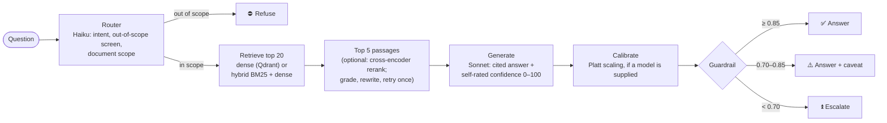

# TROA: Texas Oil and Gas Regulatory Operations Assistant

Ask questions about Texas Railroad Commission (RRC) oil and gas manuals and the Statewide Rules (16 TAC Chapter 3) in plain English. TROA answers with **citations** to the passages it used, a **confidence score**, and a **guardrail decision**: answer, answer with caveat, escalate (answer withheld), or refuse (out of scope).

> **Not for compliance decisions.** TROA is a research project. In its first judged evaluation, 3 of 9 in-scope answers were fully correct ([Results](#results-and-conclusions)). Always check an answer against its cited source before relying on it.

---

## Contents

- [Quick start](#quick-start)
- [Using TROA](#using-troa)
- [The problem](#the-problem)
- [How it works](#how-it-works)
- [Why this technology](#why-this-technology)
- [Project status](#project-status)
- [Results and conclusions](#results-and-conclusions)
- [Next steps](#next-steps)
- [Verify it yourself](#verify-it-yourself)
- [For developers](#for-developers)
- [Repository layout](#repository-layout)
- [Configuration](#configuration)
- [Documentation](#documentation)
- [Limitations](#limitations)
- [License](#license)

---

## Quick start

You need Python 3.12, Git, and an [Anthropic API key](https://console.anthropic.com/) with credits. The search index ships with the repository, so there is nothing to download or build before asking a question.

```bash
git clone https://github.com/drealchux/troa.git
cd troa
python -m venv .venv
source .venv/bin/activate          # Windows PowerShell: .venv\Scripts\Activate.ps1
pip install -r requirements.txt
cp .env.example .env               # then open .env and set ANTHROPIC_API_KEY
```

On Linux without a GPU, run `pip install torch~=2.14.1 --index-url https://download.pytorch.org/whl/cpu` before `pip install -r requirements.txt`, or pip downloads the much larger CUDA build.

**Ask in the terminal:**

```bash
python ask.py "What does the Drilling Permit Master dataset contain?"
python ask.py                      # interactive: one question per line, blank line to quit
```

**Or open the browser app:**

```bash
streamlit run dashboard/app.py     # http://localhost:8501
```

The first question downloads the embedding model (`bge-large-en-v1.5`, 1.34 GB) once. Later starts load it from disk.

In a fresh-clone test on Windows 11 with Python 3.12 (2026-10-08), `pip install -r requirements.txt` took about 4 minutes and the environment used 1.5 GB; the embedding model was already cached, so its download time is not included. On Windows, clone to a short path such as `C:	roa`: PyTorch's deeply nested files can exceed the 260-character path limit ([troubleshooting](docs/WORKFLOWS.md#10-troubleshooting)).

Only one program can open the bundled index at a time, so close `ask.py` before starting the dashboard, and vice versa.

---

## Using TROA

### What it knows

- **35 RRC oil and gas manuals:** data layouts and procedures for forms and datasets such as drilling permits (W-1), well status (W-10, G-10), organisation reports (P-5), production, and well records.
- **The Statewide Rules, 16 TAC Chapter 3** (Oil and Gas Division), as published effective 12/8/2025: 91 rules, split by rule and subsection.

It does not know other RRC chapters, docket decisions, field-specific rules, or anything published after these documents. Questions outside oil and gas regulation are refused.

### Reading an answer

| Decision | Meaning | What to do |
|---|---|---|
| ✅ Autonomous answer | Confidence ≥ 0.85 | Check the cited pages before relying on it |
| ⚠️ Answer with caveat | 0.70–0.85 | Treat it as a draft and verify against the sources |
| ⏫ Escalate | Confidence < 0.70, or nothing relevant found. The answer is withheld | Consult rrc.texas.gov or a compliance specialist. The dashboard shows the withheld draft |
| ⛔ Refuse | The question is not about RRC oil and gas regulation | Rephrase if it is |

Each source line names the document, page, and section. Confidence is the model's own rating (0–100, shown as 0–1). It has not been calibrated against measured accuracy yet, so a high score is not a guarantee.

### Options

- `python ask.py --hybrid "…"` adds keyword search, which helps with exact form numbers (W-10, P-5).
- `--agentic` lets TROA grade its passages and retry once with a rewritten query.
- `--rerank` reranks with a cross-encoder (2.24 GB download). Off by default, because it has not yet been shown to help.

The dashboard sidebar has the same switches. Defaults can be set in `.env` (see `.env.example`).

### Cost and speed

Each question makes two Claude API calls: a Haiku router call and a Sonnet answer. `--agentic` adds up to three short Haiku calls (grade, rewrite, grade again). In testing, one answer used 1,878 input and 282 output tokens on Sonnet; see [Anthropic pricing](https://www.anthropic.com/pricing). In-scope answers took 5–15 seconds on a CPU-only laptop, and out-of-scope refusals about 1 second.

### Keeping it current

RRC amends the Statewide Rules and replaces the PDF link when it does. To rebuild the index from the latest documents, see [docs/WORKFLOWS.md §2–3](docs/WORKFLOWS.md#2-download-the-corpus).

---

## The problem

RRC publishes its oil and gas information as dozens of separate PDF manuals, one per form or dataset, plus the Statewide Rules. The questions this project targets look like:

- "What does the Drilling Permit Master dataset contain?"
- "What's the deadline for filing the W-10?"
- "Does this proposed spacing need a Rule 37 exception?"

Two properties make this a hard fit for a plain chatbot:

1. **Answers must be traceable.** A regulatory answer is only useful if the reader can check it against the source page, so every answer cites the passages it used.
2. **A wrong answer costs more than no answer.** The system therefore needs to know when *not* to answer. TROA's design makes the confidence score, and the thresholds that turn it into an action, the central part of the system rather than an add-on. That part is built and has been run end to end, but not validated: the only calibrator so far is a 9-example smoke test (see [Results](#results-and-conclusions)).

---

## How it works



Three lanes, detailed in [ARCHITECTURE.md](ARCHITECTURE.md):

1. **Ingestion (offline):** download the RRC documents, split the manuals by section (headings found by font size) and the Statewide Rules by rule and subsection, embed with `bge-large-en-v1.5`, and store in Qdrant. The result is committed as `qdrant_local/`.
2. **Serving (online):** router → retriever → optional reranker → Claude generator with citations and confidence → optional calibrator → guardrail. One `Pipeline` class serves the CLI (`ask.py`), the dashboard, the HTTP API, and the eval harness, so they all give the same answers.
3. **Evaluation:** a harness runs an eval set through the pipeline, scores retrieval and refusals, has Claude Opus judge every draft against a reference answer, and writes JSONL that the Platt-scaling calibrator is fitted on.

---

## Why this technology

Each row says what is used, why, and where to check it. "Design rationale" means the reason is the author's stated intent, not something measured in this repository.

| Concern | Choice | Why | Where |
|---|---|---|---|
| PDF parsing | `pypdf` with its text visitor | The visitor reports the font size of each text run. Headings in the manuals are usually larger than body text, so font size is the main signal for finding section boundaries. Falls back to plain text extraction when the visitor fails. | `src/ingest/parse.py` |
| Chunking | Section-aware, max 512 tokens, 64-token overlap (tokens estimated as characters / 4). The Statewide Rules are split by rule and subsection instead, with a `[16 TAC §3.N …]` header on every chunk | Design rationale: a chunk that spans two record layouts confuses both retrieval and citation. Not measured here; an earlier pilot result cited in the design is not reproducible from the repo. For the rules, the font-size parser finds no reliable headings, and the header puts the rule name in every chunk so both search methods and the citations see it. | `src/ingest/chunk.py`, `src/ingest/rules.py` |
| Embeddings | `BAAI/bge-large-en-v1.5` (1024-d, MIT licence) | Open, runs on CPU, and the same model embeds the index and the questions. 1.34 GB download, once. | `src/ingest/embed.py` |
| Vector store | Qdrant (`qdrant-client` 1.19.1; server image pinned to v1.19.1) | Local-file mode (`path=`) needs no server, which is what lets the index ship inside the repository. Payload filtering on `doc_name` lets the router restrict a search to the document a question names. The same client talks to a server in Docker. | `src/ingest/store.py`, `src/serve/retrieve.py`, `compose.yml` |
| Keyword search | In-process BM25 fused with dense results by reciprocal rank fusion (RRF) | RRC questions hinge on exact identifiers (`W-10`, `P-5`, `OGA049`) that dense embeddings blur. RRF merges two rankings without putting their scores on one scale. The corpus is small (2,941 chunks), so BM25 runs in memory instead of in a second search engine. | `src/serve/hybrid.py` |
| Reranker | `BAAI/bge-reranker-large` cross-encoder, **off by default** | Design rationale: cheaper and faster than asking an LLM to rerank. Not yet shown to help on the eval set, and a 2.24 GB download, so users opt in with `--rerank` / `TROA_RERANK=true`. | `src/serve/rerank.py` |
| LLMs | Claude Haiku 4.5 (router, grader, query rewriter), Sonnet 4.6 (answers), Opus 4.7 (judge) | Small model for cheap classification steps, larger model for the answer, and a different model as judge so the generator does not grade itself. System prompts are sent with `cache_control` so repeated calls reuse the prompt cache. | `src/serve/prompts/*.yaml`, `src/eval/harness.py` |
| Confidence | Self-reported `<confidence>0–100</confidence>` tag in the same call, then Platt scaling (scikit-learn `LogisticRegression`) | The cheapest available signal (no extra call). Raw LLM self-ratings are not trustworthy on their own, which is why a calibrator fitted on judged outcomes is part of the design. | `src/serve/generate.py`, `src/eval/calibration.py` |
| User interfaces | Terminal CLI; Streamlit + Altair dashboard | Both call the same `Pipeline` over the bundled index, so no extra setup and identical answers. | `ask.py`, `dashboard/app.py` |
| HTTP API | FastAPI + Uvicorn | Typed request/response models (Pydantic), Server-Sent Events for streaming, and generated docs at `/docs`. | `src/api/app.py` |
| Answer cache | Redis if `REDIS_URL` is set, otherwise in-process memory | Optional. Any Redis error falls back to memory. Only released answers (autonomous or caveat) are cached. | `src/serve/cache.py` |
| Tests | pytest | 82 tests. Model and API calls are replaced by fakes, so they run offline. | `tests/` |

`requirements.txt` lists only the packages the code imports, pinned to the versions the tests and eval runs used. Test tools are in `requirements-dev.txt`.

---

## Project status

| Area | Component | Status |
|---|---|---|
| Use | CLI (`ask.py`) and dashboard on the bundled index | ✅ run end to end on 2026-10-08 |
| Data | RRC manual download | ✅ 36 of 37 listed PDFs download (35 manuals + the Statewide Rules); `oda037k` returns HTTP 404 (checked 2026-10-08) |
| | Statewide Rules (16 TAC Chapter 3) | ✅ effective 12/8/2025; 949 chunks from 91 rules (`src/ingest/rules.py`, 8 tests). The eval ground truth does not reference them yet |
| | Structured data, imaged permits | ⬜ downloadable with `--include-data` / `--include-all`, not parsed |
| Ingestion | Parser, section-aware chunker, `bge-large` embedder, Qdrant store | ✅ |
| Serving | Router, dense or hybrid retriever, optional reranker, generator, guardrail | ✅ |
| | Grade/rewrite loop, answer cache, per-stage trace, JSONL query log | ✅ opt-in, not yet measured on the eval set |
| | Calibrator hook | 🟡 works end to end (judge → label → fit → `--calibration`); only a 9-example smoke-test fit exists, not usable for serving |
| API | FastAPI service (`/health`, `/ask`, `/ask/stream`), Docker Compose with Qdrant and Redis | ✅ not load-tested |
| Evaluation | Harness, Opus judge, metrics library (Recall@k, MRR, κ, ECE, OOD F1), calibration CLI | ✅ |
| | Eval set | 🟡 12 of 200 planned questions |
| | Recorded end-to-end results | 🟡 three runs without the reranker, one of them judged (see below) |
| Production | CI eval gate, Phoenix tracing | ⬜ |

✅ implemented · 🟡 partial · ⬜ planned. Every known difference between the design and the code is listed in [ARCHITECTURE.md §12](ARCHITECTURE.md#12-known-gaps-between-design-and-code).

---

## Results and conclusions

### What has been measured, and can be checked

| Fact | Value | Check with |
|---|---|---|
| Unit tests | 82 passed, 0 failed | `python -m pytest -q` |
| PDFs in the downloader | 37 (36 manuals + Statewide Rules) | `MANUALS` in `data/download_data.py` |
| PDFs downloaded | 36, 16 MB | `ls data/raw/manual` |
| Bundled search index | 2,941 chunks (1,992 manual + 949 rules), 1024-d cosine, 36 documents: exactly the downloaded PDFs | [Verify it yourself](#verify-it-yourself) |
| Eval set | 12 questions: 3 single-doc factual, 2 multi-doc synthesis, 2 procedural, 2 definitional, 3 out-of-scope | `eval_data/eval_set_sample.yaml` |
| Committed harness output | 12 of 12 cases errored with `401 invalid x-api-key`; no metrics | `eval_data/results_latest.jsonl` |
| First clean run (2026-10-08) | See the table below | `eval_data/results_verify_norerank.jsonl` |
| Same run with the Statewide Rules indexed | See the table below | `eval_data/results_verify_norerank_rules.jsonl` |
| Judged run | See the table below | `eval_data/results_judged_norerank.jsonl` |

The three runs below used the index before 188 chunks from `oda037k_oil_gas_docket` (a manual that no longer downloads) were removed, so re-running them now gives slightly different retrieval.

### First end-to-end run (2026-10-08)

`python -m src.eval.harness --qdrant-path qdrant_local --no-judge --no-rerank --output eval_data/results_verify_norerank.jsonl`: vector search, no reranker, no agent loop, no calibrator, no judge, `claude-sonnet-4-6`, 12 questions.

| Metric | Result | Target |
|---|---|---|
| Errors | 0 / 12 | – |
| Recall@5 (manual level) | 0.78 (7 of 9 in-scope) | ≥ 0.85 ❌ |
| Recall@20 (manual level) | 0.89 (8 of 9) | ≥ 0.95 ❌ |
| Out-of-scope refused | 3 / 3 | ≥ 0.95 ✅ |
| In-scope escalated | 5 / 9 (0.56) | ≤ 0.10 ❌ |
| OOD F1 (escalations count as refusals) | 0.55 | ≥ 0.85 ❌ |
| Average latency | 7.0 s | – |

Of the 5 escalated in-scope questions, 3 had a correct manual in the top 5. On those the model rated its own confidence low (2, 22, 30 out of 100), so the escalations were not caused by retrieval misses alone. For example, the W-10 filing-deadline question (`sdf-001`) retrieved the W-10 manual and still got confidence 2. With 9 in-scope questions, one question moves recall by 0.11, so these numbers show direction only.

### Second run: with the Statewide Rules (2026-10-08)

Same command and settings, after adding the rules to the index (`--output eval_data/results_verify_norerank_rules.jsonl`).

| Metric | Without rules | With rules |
|---|---|---|
| Errors | 0 / 12 | 0 / 12 |
| Recall@5 (manual level) | 0.78 | 0.67 |
| Recall@20 (manual level) | 0.89 | 0.89 |
| Out-of-scope refused | 3 / 3 | 3 / 3 |
| In-scope decisions: answered / caveat / escalated | 3 / 1 / 5 | 2 / 3 / 4 |
| Average latency | 7.0 s | 7.4 s |

How to read it:

- **Rules passages displaced manuals for 3 questions.** For the high-cost-gas questions (`pro-001`, `mds-001`), all 5 top passages came from Rule 3.101 (*Certification for Severance Tax Exemption…*). For the transportation-authority question (`sdf-003`), 4 of 5 came from Rule 3.58 (*Certificate of Compliance and Transportation Authority…*). By title these are the governing rules, but the eval ground truth lists only manuals, so `pro-001` now scores as a retrieval miss. That is the whole drop in Recall@5: an eval-set gap, not necessarily worse retrieval.
- **Confidence rose where rules were retrieved.** `pro-001` went from escalate (30) to caveat (82); `mds-001` from 42 to 62, still escalated.
- **The W-10 deadline question is unchanged** (escalate, confidence 2). No rules passage was retrieved for it, and only one rules passage contains "W-10" (in Rule 3.86, horizontal drainhole wells). Its answer may be in a source TROA does not have, or its ground truth may need checking.
- `pro-002` moved from answered (88) to caveat (82) with no rules passages retrieved, which suggests the model's self-rated confidence varies between runs by itself. That is one more reason to calibrate before trusting the thresholds.

### Third run: judged, and a smoke-test calibrator (2026-10-08)

Same settings as the second run, with the Opus judge on (`eval_data/results_judged_norerank.jsonl`). The judge scores every generated draft, including escalated ones, against the eval set's reference answer. A draft counts as **correct** when correctness = 2 (it gives the reference information) and faithfulness = 2 (nothing unsupported).

| Case | Decision | Raw confidence | Correct? | Judge's reason, shortened |
|---|---|---|---|---|
| `sdf-003` | answered | 90 | ✅ | identifies Form P-4 |
| `def-001` | caveat | 82 | ✅ | defines a P-5 organisation correctly |
| `def-002` | answered | 88 | ✅ | describes Rule 14(b)(2) |
| `pro-002` | answered | 88 | ❌ | omits the key reference detail |
| `pro-001` | caveat | 82 | ❌ | well grounded, but misses part of the reference |
| `mds-001` | escalated | 62 | ❌ | misses the key reference point |
| `mds-002` | escalated | 22 | ❌ | does not give the key distinction |
| `sdf-001` | escalated | 2 | ❌ | declines to give the W-10 deadline |
| `sdf-002` | escalated | 2 | ❌ | says it cannot find the update frequency |

3 of 9 drafts are correct. Every correct draft had confidence ≥ 82, and every draft under 70 was wrong, so raw confidence carries signal. But two confident drafts (82 and 88) were wrong, and one of them (`pro-002`) was released as an autonomous answer.

`python -m src.eval.calibration train --results eval_data/results_judged_norerank.jsonl --output calibration/v0_smoke.json` fits a Platt calibrator: ECE 0.26 raw → 0.17 calibrated, **measured on the same 9 examples it was fitted on**. It maps every raw confidence into 0.25–0.40 (raw 90 → 0.38), so with the 0.70 / 0.85 thresholds it would escalate everything. Two reasons: 9 examples, and L2 regularisation (`C=1.0`) on a 0–1 feature, which holds the slope near zero at this sample size. It shows the loop works; it is not a calibrator to serve. The fitted file is git-ignored (`calibration/*.json`) and reproducible from the committed results.

### Reported but not verifiable

Earlier versions of this README reported a dashboard eval run from 2026-10-08 (hybrid search, router and agent loop, `claude-sonnet-4-6`, 12 questions): Hit@5 0.67, MRR 0.58, OOD refusal 3/3, in-scope refusal 5/9. **No output from that run is saved in the repository**, and it used an earlier dashboard engine that has since been replaced, so it cannot be checked.

### Conclusions

What the evidence above supports:

1. **TROA runs end to end and can be used today, but its answers are often incomplete.** 3 of 9 in-scope drafts were correct against the reference answers. Out-of-scope questions were refused every time. On 9 questions this is direction only, and no run has used the reranker.
2. **The project's central claim, calibrated confidence, is still unproven.** The loop works (judge, label, fit, serve with `--calibration`), and raw confidence separated right from wrong drafts in this small run. But the only fit used 9 examples and is not usable, so the guardrail still acts on raw self-rated confidence. The 0.85 / 0.70 thresholds are design choices, not values derived from data.
3. **Adding the rules helped some questions but is not the whole answer.** With the Statewide Rules indexed, rule passages were retrieved for 3 of 9 in-scope questions and confidence rose on 2 of them. The W-10 deadline question did not change, and the eval ground truth must be updated before retrieval metrics can credit rule passages.
4. **The eval set is too small to support conclusions.** With 12 questions, and ground truth at the manual level rather than the passage level, even a clean run shows direction only.

---

## Next steps

In order of priority. Each step produces something checkable.

1. **Grow the eval set** toward 100–200 questions, with reference answers checked against the documents and train/dev/holdout splits. This is the main bottleneck: accuracy work and the calibrator both depend on it. New questions go in `eval_data/eval_set_sample.yaml` ([template in WORKFLOWS §9](docs/WORKFLOWS.md#9-add-evaluation-questions)).
2. **Credit the Statewide Rules in the eval set.** Add the relevant rules to `ground_truth_chunks` (for example Rule 3.101 for the high-cost-gas questions, after checking the text), and verify where the W-10 deadline is actually stated.
3. **Run the ablation.** `python tasks.py eval-ablation` compares vector, vector + reranker, hybrid, and hybrid + agent loop on the same questions. Turn on by default whatever measurably helps.
4. **Improve citation section labels.** The manual parser sometimes takes table-of-contents lines as section headings, so some source lines show labels such as `GIS BOTTOM HOLE LOCATION DATA II.77`.
5. **Fit and validate the calibrator** on the train split, inspect it on dev (target ECE ≤ 0.08), and then set the thresholds from the cost model in [EVALUATION.md](EVALUATION.md). Revisit the L2 strength (`C` in `fit_platt`) once there are enough examples; at small n it dominates the fit.
6. **Collect human labels** for a subset to validate the Opus judge (target κ ≥ 0.6).
7. **Automate the eval gate in CI.**

---

## Verify it yourself

Every figure in this README can be reproduced from the repository:

```bash
python -m pytest -q                                  # 82 passed (pip install -r requirements-dev.txt)
ls data/raw/manual | wc -l                           # 36 (after python data/download_data.py)
python -c "import sys; sys.path.insert(0,'data'); import download_data as d; print(len(d.MANUALS))"   # 37

# Committed eval output: count errored cases
python -c "import json; r=[json.loads(l) for l in open('eval_data/results_latest.jsonl')]; print(sum(bool(x['error']) for x in r), 'errors of', len(r))"

# Bundled search index: points, dimension, documents
python -c "
from qdrant_client import QdrantClient
c = QdrantClient(path='qdrant_local'); i = c.get_collection('troa_chunks')
names, off = set(), None
while True:
    pts, off = c.scroll('troa_chunks', with_payload=['doc_name'], limit=1000, offset=off)
    names |= {p.payload['doc_name'] for p in pts}
    if off is None: break
print(i.points_count, i.config.params.vectors.size, len(names))"   # 2941 1024 36
```

Model names are in the `model:` line of each file in `src/serve/prompts/` and in `JUDGE_MODEL` in `src/eval/harness.py`. Guardrail thresholds are in `src/serve/guardrail.py`.

---

## For developers

Full procedures, with verification steps, are in [docs/WORKFLOWS.md](docs/WORKFLOWS.md). Install the test tools with `pip install -r requirements-dev.txt`.

| Goal | Command | Needs |
|---|---|---|
| Rebuild the index | `python data/download_data.py`, then `python -m src.ingest.pipeline --corpus data/raw/manual/ --qdrant-path qdrant_local` | About 16 MB of PDFs; embedding takes a while on CPU |
| Evaluation harness | `python -m src.eval.harness --eval-set eval_data/eval_set_sample.yaml --output eval_data/results_latest.jsonl --qdrant-path qdrant_local` | Key. Add `--search-mode hybrid`, `--agentic`, `--rerank`, `--no-judge`, `--calibration <json>` |
| HTTP API | `uvicorn src.api.app:app --port 8000` (or `docker compose up`) | Settings in `.env`. Docs at `/docs` |
| Calibrator | `python -m src.eval.calibration train --results <judged results> --output calibration/v1.json` | Judged results; see [WORKFLOWS §6](docs/WORKFLOWS.md#6-fit-and-apply-the-calibrator) |
| Tests | `python -m pytest -q` | `requirements-dev.txt` |

**Shortcuts:** `python tasks.py` lists short names for these commands, for example `python tasks.py ask "…"`, `python tasks.py test`, `python tasks.py eval`, `python tasks.py eval-ablation`, `python tasks.py api`. Extra arguments are passed through (`python tasks.py eval --no-judge`). It needs only Python, so it works on Windows without `make`.

---

## Repository layout

```
troa/
├── README.md                  This file
├── LICENSE                    Apache License 2.0
├── ARCHITECTURE.md            System design, diagrams, status, design/code gaps
├── EVALUATION.md              Metric definitions, targets, calibration and threshold methodology
├── docs/
│   ├── WORKFLOWS.md           Step-by-step procedures and troubleshooting
│   └── DASHBOARD.md           Dashboard guide
├── ask.py                     Ask a question in the terminal
├── .env.example               Template for .env (API key, serving options)
├── requirements.txt           Runtime dependencies (tested versions)
├── requirements-dev.txt       + test tools
├── tasks.py                   Task runner: python tasks.py <task>
├── Dockerfile, compose.yml    API image; Qdrant + Redis + API stack
├── data/
│   └── download_data.py       RRC document downloader → data/raw/ (git-ignored)
├── src/
│   ├── ingest/                parse · chunk · embed · store · pipeline · rules (Statewide Rules chunker)
│   ├── serve/                 router · retrieve · hybrid · rerank · agent · generate · guardrail · scope · cache · telemetry · pipeline
│   │   └── prompts/           router_v1 · generate_v1 · grader_v1 · rewrite_v1 · caveats (YAML)
│   ├── eval/                  harness · metrics · calibration
│   ├── api/                   app.py (FastAPI: /health, /ask, /ask/stream)
│   └── config.py              Settings from .env; builds the Pipeline
├── dashboard/
│   └── app.py                 Streamlit app over the same Pipeline
├── eval_data/
│   ├── eval_set_sample.yaml   12 questions across 5 categories with reference answers
│   └── results_*.jsonl        Saved harness runs (see Results)
├── qdrant_local/              Bundled search index (troa_chunks: 2,941 points, 1024-d, 36 documents)
├── notebooks/
│   └── 01_calibration_analysis.ipynb   Reliability diagrams and threshold policy (needs judged results)
└── tests/                     test_ingest.py (29) · test_metrics.py (17) · test_rules.py (8) · test_serve.py (28)
```

---

## Configuration

| Setting | Where | Default |
|---|---|---|
| `ANTHROPIC_API_KEY` | `.env` or environment | – (required) |
| Search index | `.env`: `QDRANT_PATH` or `QDRANT_URL` | the bundled `qdrant_local/` when neither is set |
| Serving options | `.env`: `TROA_SEARCH_MODE`, `TROA_AGENTIC`, `TROA_RERANK`, `TROA_CALIBRATION`, `TROA_CACHE`, `REDIS_URL`, `TROA_QUERY_LOG` | vector, off, off, none, on (memory), none, off |
| Router model / prompt | `src/serve/prompts/router_v1.yaml` | `claude-haiku-4-5-20251001` |
| Answer model / prompt | `src/serve/prompts/generate_v1.yaml` | `claude-sonnet-4-6` |
| Grader and rewriter | `grader_v1.yaml`, `rewrite_v1.yaml` | `claude-haiku-4-5-20251001` |
| Judge model | `JUDGE_MODEL` in `src/eval/harness.py` | `claude-opus-4-7` |
| Guardrail thresholds | `THRESHOLD_*` and `OOD_CUTOFF` in `src/serve/guardrail.py` | 0.85 / 0.70; OOD 0.85 |
| Caveat and refusal text | `src/serve/prompts/caveats.yaml` | – |
| Embedding model | `Pipeline(embed_model=…)` | `bge-large-en-v1.5` (changing it means rebuilding the index) |
| Chunking | `ChunkingConfig` in `src/ingest/chunk.py` | 512 / 64 tokens |
| Retrieval depth | `Pipeline(retrieve_top_k=20, rerank_top_k=5)` | 20 → 5 |

`Pipeline` itself leaves the cache and every other optional feature off; `ask.py`, the dashboard, and the API read the settings above from `.env`, and turn the answer cache on unless `TROA_CACHE=false`. Prompts are versioned by filename. To change one, add a new version rather than editing in place ([WORKFLOWS §7](docs/WORKFLOWS.md#7-change-a-prompt-or-model)).

---

## Documentation

| Document | Read it for |
|---|---|
| [ARCHITECTURE.md](ARCHITECTURE.md) | System overview, component status, ingestion, serving, guardrail, eval flow, data model, design decisions, known gaps |
| [EVALUATION.md](EVALUATION.md) | Eval set design, metric definitions and targets, judge validation, calibration method, cost-based threshold policy, CI gates |
| [docs/WORKFLOWS.md](docs/WORKFLOWS.md) | Setup, download, ingestion, querying, evaluation, calibration, prompt changes, adding documents and questions, troubleshooting |
| [docs/DASHBOARD.md](docs/DASHBOARD.md) | Dashboard tabs and settings |

---

## Limitations

- This is a research project on public regulatory data. It has not been reviewed by working compliance officers. **Do not use it for compliance decisions.**
- The eval set was written by the author, not by domain experts, and has 12 questions.
- Retrieval ground truth is at the manual level, not the passage level, so Hit@k and MRR are lenient.
- Confidence is uncalibrated until a calibrator is fitted. The planned calibration is aggregate, not per question category.
- The LLM judge has not been validated: the κ computation exists, but no human labels have been collected.
- Of the RRC rules, only Chapter 3 (Oil and Gas Division) is in the corpus, as published effective 12/8/2025. RRC replaces the PDF link when rules are amended, so the download URL needs updating then.
- Tested on Windows 11 with Python 3.12. Other platforms and Python versions are untested.
- Deliberately out of scope for v1: fine-tuning the embedder or reranker, OCR or vision for the imaged W-1 permits (which contain drawings), and monitoring beyond JSONL logs.

## License

The code is licensed under the [Apache License 2.0](LICENSE). The RRC documents are downloaded from rrc.texas.gov and the PDFs are not committed (`data/raw/` is git-ignored), but the bundled `qdrant_local/` index contains text extracted from them. Check RRC's terms before reusing that text.
