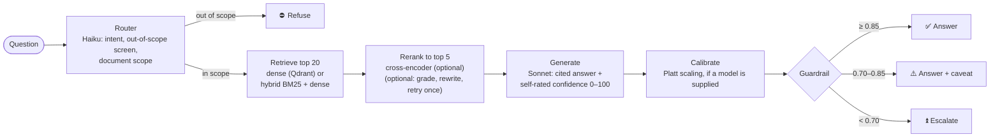

# TROA: Texas Oil and Gas Regulatory Operations Assistant

A retrieval-augmented generation (RAG) assistant for questions about Texas Railroad Commission (RRC) oil and gas manuals and the Statewide Rules (16 TAC Chapter 3). A question goes in; TROA returns an answer with **citations** to the manual passages it used, a **confidence score**, and a **guardrail decision**: answer, answer with caveat, escalate, or refuse.


---

## Contents

- [The problem](#the-problem)
- [What TROA does](#what-troa-does)
- [Why this technology](#why-this-technology)
- [Project status](#project-status)
- [Results and conclusions](#results-and-conclusions)
- [Next steps](#next-steps)
- [Verify it yourself](#verify-it-yourself)
- [Quick start](#quick-start)
- [Repository layout](#repository-layout)
- [Configuration](#configuration)
- [Documentation](#documentation)
- [Limitations](#limitations)
- [License](#license)

---

## The problem

RRC publishes its oil and gas information as dozens of separate PDF manuals, one per form or dataset (drilling permits, well status reports such as W-10 and G-10, operator organisation reports such as P-5, production data, and so on). The questions this project targets look like:

- "What does the Drilling Permit Master dataset contain?"
- "What's the deadline for filing the W-10?"
- "Does this proposed spacing need a Rule 37 exception?"

Two properties make this a hard fit for a plain chatbot:

1. **Answers must be traceable.** A regulatory answer is only useful if the reader can check it against the source page, so every answer cites the passages it used.
2. **A wrong answer costs more than no answer.** The system therefore needs to know when *not* to answer. TROA's design makes the confidence score, and the thresholds that turn it into an action, the central part of the system rather than an add-on. That part is built and has been run end to end once, but not validated: the only calibrator so far is a 9-example smoke test (see [Results](#results-and-conclusions)).

---

## What TROA does



Three lanes, detailed in [ARCHITECTURE.md](ARCHITECTURE.md):

1. **Ingestion (offline):** download the RRC manuals, parse them with font-size-based heading detection, chunk by section, embed with `bge-large-en-v1.5`, and store in Qdrant.
2. **Serving (online):** router → retriever → cross-encoder reranker → Claude generator with citations and confidence → optional calibrator → guardrail. Exposed as a Python class (`Pipeline`) and an HTTP API.
3. **Evaluation:** a harness runs an eval set through the pipeline, scores retrieval and refusals, has Claude Opus judge answer quality, and writes JSONL that the Platt-scaling calibrator can be fitted on.

A **Streamlit dashboard** runs a lighter version of the serving lane in one process (smaller embedding model, no Qdrant, no reranker) for demos and quick ablations.

---

## Why this technology

Each row says what is used, why, and where to check it. "Design rationale" means the reason is the author's stated intent, not something measured in this repository.

| Concern | Choice | Why | Where |
|---|---|---|---|
| PDF parsing | `pypdf` with its text visitor | The visitor reports the font size of each text run. Headings in the manuals are usually larger than body text, so font size is the main signal for finding section boundaries. Falls back to plain text extraction when the visitor fails. | `src/ingest/parse.py` |
| Chunking | Section-aware, max 512 tokens, 64-token overlap (tokens estimated as characters / 4). The Statewide Rules are split by rule and subsection instead, with a `[16 TAC §3.N …]` header on every chunk | Design rationale: a chunk that spans two record layouts confuses both retrieval and citation. Not measured here; an earlier pilot result cited in the design is not reproducible from the repo. For the rules, the font-size parser finds no reliable headings, and the header puts the rule name in every chunk so both search methods and the citations see it. | `src/ingest/chunk.py`, `src/ingest/rules.py` |
| Embeddings | `BAAI/bge-large-en-v1.5` (1024-d, MIT licence); `bge-small-en-v1.5` in the dashboard | `bge-large` for the reference pipeline. `bge-small` weights are about 0.13 GB against 1.34 GB for `bge-large`, which keeps the dashboard workable on a CPU laptop. | `src/ingest/embed.py`, `mvp_rag.py` |
| Vector store | Qdrant (`qdrant-client` 1.19.1; server image pinned to v1.19.1) | Payload filtering on `doc_name` lets the router restrict a search to the manual a question names. Local-file mode (`path=`) needs no server; the same client talks to a server in Docker. | `src/ingest/store.py`, `src/serve/retrieve.py`, `compose.yml` |
| Keyword search | In-process BM25 fused with dense results by reciprocal rank fusion (RRF) | RRC questions hinge on exact identifiers (`W-10`, `P-5`, `OGA049`) that dense embeddings blur. RRF merges two rankings without putting their scores on one scale. The corpus is small (3,129 chunks in the committed store), so BM25 runs in memory instead of in a second search engine. | `src/serve/hybrid.py` |
| Reranker | `BAAI/bge-reranker-large` cross-encoder | Design rationale: cheaper and faster than asking an LLM to rerank. Not benchmarked here, so it is optional: `rerank=False` (`--no-rerank`, `TROA_RERANK=false`) skips it and keeps the top 5 by retrieval score. On by default. | `src/serve/rerank.py` |
| LLMs | Claude Haiku 4.5 (router, grader, query rewriter), Sonnet 4.6 (answers), Opus 4.7 (judge) | Small model for cheap classification steps, larger model for the answer, and a different model as judge so the generator does not grade itself. System prompts are sent with `cache_control` so repeated calls reuse the prompt cache. | `src/serve/prompts/*.yaml`, `src/eval/harness.py` |
| Confidence | Self-reported `<confidence>0–100</confidence>` tag in the same call, then Platt scaling (scikit-learn `LogisticRegression`) | The cheapest available signal (no extra call). Raw LLM self-ratings are not trustworthy on their own, which is why a calibrator fitted on judged outcomes is part of the design. | `src/serve/generate.py`, `src/eval/calibration.py` |
| HTTP API | FastAPI + Uvicorn | Typed request/response models (Pydantic), Server-Sent Events for streaming, and generated docs at `/docs`. | `src/api/app.py` |
| Answer cache | Redis if `REDIS_URL` is set, otherwise in-process memory | Optional. Any Redis error falls back to memory. Only released answers (autonomous or caveat) are cached. | `src/serve/cache.py` |
| Dashboard | Streamlit + Altair | One local process with no Docker or Qdrant. | `dashboard/` |
| Tests | pytest | 80 tests. Model and API calls are replaced by fakes, so they run offline. | `tests/` |

**Listed but not used.** `requirements.txt` also installs `openai`, `unstructured[pdf]`, `pytesseract`, `Pillow`, `pyarrow`, `ragas`, `arize-phoenix`, and `structlog`. None of them is imported by any file under `src/`, `dashboard/`, `tests/`, `data/`, or `mvp_rag.py`. `matplotlib` is used only by the notebook. The `Dockerfile` installs `tesseract-ocr` and `poppler-utils`, which the code also does not use. Phoenix tracing and OCR are planned but not built; the rest can be pruned.

---

## Project status

| Area | Component | Status |
|---|---|---|
| Data | RRC manual download | ✅ 36 of 37 listed PDFs download (35 manuals + the Statewide Rules); `oda037k` returns HTTP 404 (checked 2026-10-08) |
| | Structured data, imaged permits | ⬜ downloadable with `--include-data` / `--include-all`, not parsed |
| | Statewide Rules (16 TAC Chapter 3) | ✅ PDF effective 12/8/2025, chunked by rule and subsection (`src/ingest/rules.py`, 8 tests), ingested: 949 chunks from 91 rules. The eval set's ground truth does not reference it yet |
| Ingestion | Parser, section-aware chunker, `bge-large` embedder, Qdrant store | ✅ |
| Serving | Router, dense or hybrid retriever, cross-encoder reranker, generator, guardrail | ✅ unit-tested with fakes |
| | Grade/rewrite loop, answer cache, per-stage trace, JSONL query log | ✅ opt-in, not yet measured on the eval set |
| | Calibrator hook | 🟡 works end to end (judge → label → fit → `--calibration`); only a 9-example smoke-test fit exists, not usable for serving |
| API | FastAPI service (`/health`, `/ask`, `/ask/stream`), Docker Compose with Qdrant and Redis | ✅ not load-tested |
| Dashboard | Hybrid search, agent loop, streaming, cache, tracing, eval tab | ✅ |
| Evaluation | Harness, Opus judge, metrics library (Recall@k, MRR, κ, ECE, OOD F1), calibration CLI | ✅ |
| | Eval set | 🟡 12 of 200 planned questions |
| | Recorded end-to-end results | 🟡 one run without reranker or judge (see below) |
| Production | CI eval gate, Phoenix tracing | ⬜ |

✅ implemented · 🟡 partial · ⬜ planned. Every known difference between the design and the code is listed in [ARCHITECTURE.md §12](ARCHITECTURE.md#12-known-gaps-between-design-and-code).

---

## Results and conclusions

### What has been measured, and can be checked

| Fact | Value | Check with |
|---|---|---|
| Unit tests | 80 passed, 0 failed | `python -m pytest -q` |
| PDFs in the downloader | 37 (36 manuals + Statewide Rules) | `MANUALS` in `data/download_data.py` |
| PDFs downloaded | 36, 16 MB | `ls data/raw/manual` |
| Committed Qdrant store | 3,129 points, 1024-d cosine, 37 documents (949 points are the Statewide Rules) | [Verify it yourself](#verify-it-yourself) |
| Dashboard chunk cache | 4,820 chunks from 35 manuals (built before the rules were added; the dashboard indexes the rules PDF on its next launch) | `data/processed/dashboard/*.json` |
| Eval set | 12 questions: 3 single-doc factual, 2 multi-doc synthesis, 2 procedural, 2 definitional, 3 out-of-scope | `eval_data/eval_set_sample.yaml` |
| Committed harness output | 12 of 12 cases errored with `401 invalid x-api-key`; no metrics | `eval_data/results_latest.jsonl` |
| First clean run (2026-10-08) | See the table below | `eval_data/results_verify_norerank.jsonl` |
| Same run with the Statewide Rules indexed | See the table below | `eval_data/results_verify_norerank_rules.jsonl` |

Two details matter when reading these numbers:

- The committed Qdrant store contains 188 chunks from `oda037k_oil_gas_docket`, a manual that no longer downloads. The Statewide Rules were added to the store on their own (only that PDF was embedded). Re-ingesting from today's download produces a different store: no docket chunks.
- The two pipelines chunk differently (section-aware in Qdrant, fixed 800-character windows in the dashboard), so their chunk counts are not comparable.

### First end-to-end run (2026-10-08)

`python -m src.eval.harness --qdrant-path qdrant_local --no-judge --no-rerank --output eval_data/results_verify_norerank.jsonl`: vector search, no reranker, no agent loop, no calibrator, no judge, `claude-sonnet-4-6`, 12 questions.

| Metric | Result | Target |
|---|---|---|
| Errors | 0 / 12 | – |
| Recall@5 (manual level) | 0.78 (7 of 9 in-scope) | ≥ 0.85 ❌ |
| Recall@20 (manual level) | 0.89 (8 of 9) | ≥ 0.95 ❌ |
| Out-of-scope refused | 3 / 3 | ≥ 0.95 ✅ |
| In-scope escalated | 5 / 9 (0.56) | ≤ 0.10 ❌ |
| OOD F1 (escalations count as refusals) | 0.55 | ≥ 0.85 ❌ |
| Average latency | 7.0 s | – |

Of the 5 escalated in-scope questions, 3 had a correct manual in the top 5. On those the model rated its own confidence low (2, 22, 30 out of 100), so the escalations were not caused by retrieval misses alone. For example, the W-10 filing-deadline question (`sdf-001`) retrieved the W-10 manual and still got confidence 2. That fits the hypothesis that data-layout manuals don't state rules, but without the judge or a read of the retrieved passages it is not proven. With 9 in-scope questions, one question moves recall by 0.11, so these numbers show direction only.

### Second run: with the Statewide Rules (2026-10-08)

Same command and settings, after adding the rules to the index (`--output eval_data/results_verify_norerank_rules.jsonl`).

| Metric | Without rules | With rules |
|---|---|---|
| Errors | 0 / 12 | 0 / 12 |
| Recall@5 (manual level) | 0.78 | 0.67 |
| Recall@20 (manual level) | 0.89 | 0.89 |
| Out-of-scope refused | 3 / 3 | 3 / 3 |
| In-scope decisions: answered / caveat / escalated | 3 / 1 / 5 | 2 / 3 / 4 |
| Average latency | 7.0 s | 7.4 s |

How to read it:

- **Rules passages displaced manuals for 3 questions.** For the high-cost-gas questions (`pro-001`, `mds-001`), all 5 top passages came from Rule 3.101 (*Certification for Severance Tax Exemption…*). For the transportation-authority question (`sdf-003`), 4 of 5 came from Rule 3.58 (*Certificate of Compliance and Transportation Authority…*). By title these are the governing rules, but the eval ground truth lists only manuals, so `pro-001` now scores as a retrieval miss. That is the whole drop in Recall@5: an eval-set gap, not necessarily worse retrieval.
- **Confidence rose where rules were retrieved.** `pro-001` went from escalate (30) to caveat (82); `mds-001` from 42 to 62, still escalated.
- **The W-10 deadline question is unchanged** (escalate, confidence 2). No rules passage was retrieved for it, and only one rules passage contains "W-10" (in Rule 3.86, horizontal drainhole wells). So the "missing rules" hypothesis does not explain this question; its answer may be in a source TROA does not have, or its ground truth may need checking.
- `pro-002` moved from answered (88) to caveat (82) with no rules passages retrieved, which suggests the model's self-rated confidence varies between runs by itself. That is one more reason to calibrate before trusting the thresholds.

Without the judge it is not known whether any answer is correct, and one question still moves a rate by 0.11.

### Third run: judged, and a smoke-test calibrator (2026-10-08)

Same settings as the second run, with the Opus judge on (`eval_data/results_judged_norerank.jsonl`). The judge now scores every generated draft, including escalated ones, against the eval set's reference answer. A draft counts as **correct** when correctness = 2 (it gives the reference information) and faithfulness = 2 (nothing unsupported).

| Case | Decision | Raw confidence | Correct? | Judge's reason, shortened |
|---|---|---|---|---|
| `sdf-003` | answered | 90 | ✅ | identifies Form P-4 |
| `def-001` | caveat | 82 | ✅ | defines a P-5 organisation correctly |
| `def-002` | answered | 88 | ✅ | describes Rule 14(b)(2) |
| `pro-002` | answered | 88 | ❌ | omits the key reference detail |
| `pro-001` | caveat | 82 | ❌ | well grounded, but misses part of the reference |
| `mds-001` | escalated | 62 | ❌ | misses the key reference point |
| `mds-002` | escalated | 22 | ❌ | does not give the key distinction |
| `sdf-001` | escalated | 2 | ❌ | declines to give the W-10 deadline |
| `sdf-002` | escalated | 2 | ❌ | says it cannot find the update frequency |

3 of 9 drafts are correct. Every correct draft had confidence ≥ 82, and every draft under 70 was wrong, so raw confidence carries signal. But two confident drafts (82 and 88) were wrong, and one of them (`pro-002`) was released as an autonomous answer.

`python -m src.eval.calibration train --results eval_data/results_judged_norerank.jsonl --output calibration/v0_smoke.json` fits a Platt calibrator: ECE 0.26 raw → 0.17 calibrated, **measured on the same 9 examples it was fitted on**. It maps every raw confidence into 0.25–0.40 (raw 90 → 0.38), so with the 0.70 / 0.85 thresholds it would escalate everything. Two reasons: 9 examples, and L2 regularisation (`C=1.0`) on a 0–1 feature, which holds the slope near zero at this sample size. It shows the loop works; it is not a calibrator to serve. The fitted file is git-ignored (`calibration/*.json`) and reproducible from the committed results.

### Reported but not verifiable

Earlier versions of this README reported a dashboard eval run from 2026-10-08 (hybrid search, router and agent loop, `claude-sonnet-4-6`, 12 questions): Hit@5 0.67, MRR 0.58, OOD refusal 3/3, in-scope refusal 5/9. **No output from that run is saved in the repository**, so it cannot be checked. Treat it as an anecdote until it is reproduced with saved output.

### Conclusions

What the evidence above supports:

1. **The system runs end to end, and the first judged run is weak.** 3 of 9 in-scope drafts were correct against the reference answers. On 9 questions this is direction only, and no run has used the reranker.
2. **The project's central claim, calibrated confidence, is still unproven.** The loop works (judge, label, fit, serve with `--calibration`), and raw confidence separated right from wrong drafts in this small run. But the only fit used 9 examples and is not usable, so the guardrail still acts on raw self-rated confidence. The 0.85 / 0.70 thresholds are design choices, not values derived from data.
3. **Adding the rules helped some questions but is not the whole answer.** Most manuals document data files (record layouts, field definitions). With the Statewide Rules indexed, rule passages were retrieved for 3 of 9 in-scope questions and confidence rose on 2 of them. The W-10 deadline question did not change, and the eval ground truth must be updated before retrieval metrics can credit rule passages.
4. **The eval set is too small to support conclusions.** With 12 questions, and ground truth at the manual level rather than the passage level, even a clean run would show direction only.

---

## Next steps

In order of priority. Each step produces something checkable.

1. **Record a judged baseline with the reranker.** A judged run without the reranker exists (`results_judged_norerank.jsonl`). Finish the `bge-reranker-large` download, run `python tasks.py eval`, and commit `eval_data/results_latest.jsonl`, replacing the errored file ([WORKFLOWS §5](docs/WORKFLOWS.md#5-run-the-evaluation)).
2. **Run the ablation.** `python tasks.py eval-ablation` compares vector, hybrid, and hybrid + agent loop on the same questions. Commit all three result files. Each run also records `recall_at_5` (before reranking) and `ranked_recall_at_5` (after), which shows whether the reranker earns its 2.24 GB; `--no-rerank` runs the pipeline without it.
3. **Credit the Statewide Rules in the eval set.** Add the relevant rules to `ground_truth_chunks` (for example Rule 3.101 for the high-cost-gas questions, after checking the text), and verify where the W-10 deadline is actually stated.
4. **Rebuild the Qdrant store** from the current download so it matches what the scripts produce (removes the docket-manual chunks).
5. **Grow the eval set** toward 200 questions with train/dev/holdout splits, writing ground truth from the corpus and recording it at passage level.
6. **Fit and validate the calibrator** on the train split, inspect it on dev (target ECE ≤ 0.08), and then set the thresholds from the cost model in [EVALUATION.md](EVALUATION.md). Revisit the L2 strength (`C` in `fit_platt`) once there are enough examples; at small n it dominates the fit.
7. **Collect human labels** for a subset to validate the Opus judge (target κ ≥ 0.6).
8. **Automate the eval gate in CI**, and prune unused dependencies from `requirements.txt` and the `Dockerfile`.

---

## Verify it yourself

Every figure in this README can be reproduced from the repository:

```bash
python -m pytest -q                                  # 80 passed
ls data/raw/manual | wc -l                           # 36 (after python data/download_data.py)
python -c "import sys; sys.path.insert(0,'data'); import download_data as d; print(len(d.MANUALS))"   # 37

# Committed eval output: count errored cases
python -c "import json; r=[json.loads(l) for l in open('eval_data/results_latest.jsonl')]; print(sum(bool(x['error']) for x in r), 'errors of', len(r))"

# Committed Qdrant store: points, dimension, documents
python -c "
from qdrant_client import QdrantClient
c = QdrantClient(path='qdrant_local'); i = c.get_collection('troa_chunks')
names, off = set(), None
while True:
    pts, off = c.scroll('troa_chunks', with_payload=['doc_name'], limit=1000, offset=off)
    names |= {p.payload['doc_name'] for p in pts}
    if off is None: break
print(i.points_count, i.config.params.vectors.size, len(names))"   # 3129 1024 37
```

Model names are in the `model:` line of each file in `src/serve/prompts/` and in `JUDGE_MODEL` in `src/eval/harness.py`. Guardrail thresholds are in `src/serve/guardrail.py`.

---

## Quick start

Full procedures, with verification steps, are in [docs/WORKFLOWS.md](docs/WORKFLOWS.md).

### 1. Install and configure

```bash
python -m venv .venv
source .venv/bin/activate                 # Windows PowerShell: .venv\Scripts\Activate.ps1
pip install -r requirements.txt           # or a lighter profile, see WORKFLOWS §1
cp .env.example .env                      # set ANTHROPIC_API_KEY (workspace-scoped key with credits)
python data/download_data.py              # 35 RRC manuals + the Statewide Rules, about 16 MB
```

### 2. Pick an entry point

| Goal | Command | Needs |
|---|---|---|
| Smoke test | `python mvp_rag.py "What does the Drilling Permit Master dataset contain?"` | Corpus, key |
| Interactive dashboard | `streamlit run dashboard/app.py` | Corpus, key; the first run embeds every manual |
| Reference pipeline | `python -m src.ingest.pipeline --corpus data/raw/manual/ --qdrant-path qdrant_local`, then `Pipeline(qdrant_path="qdrant_local")` | Corpus, key, full install, about 3.6 GB of model downloads |
| Evaluation harness | `python -m src.eval.harness --eval-set eval_data/eval_set_sample.yaml --output eval_data/results_latest.jsonl --qdrant-path qdrant_local` | As above. Add `--search-mode hybrid`, `--agentic`, `--no-rerank`, `--calibration <json>` for ablations |
| HTTP API | `uvicorn src.api.app:app --port 8000` (or `docker compose up`) | Ingested Qdrant; settings in `.env`. Docs at `/docs` |
| Calibrator | `python -m src.eval.calibration train --results <judged results> --output calibration/v1.json` | Judged results; see [WORKFLOWS §6](docs/WORKFLOWS.md#6-fit-and-apply-the-calibrator) |
| Tests | `python -m pytest -q` | Full install |

**Shortcuts:** `python tasks.py` lists short names for these commands, for example `python tasks.py test`, `python tasks.py eval`, `python tasks.py eval-ablation`, `python tasks.py api`. Extra arguments are passed through (`python tasks.py eval --no-judge`). It needs only Python, so it works on Windows without `make`.

---

## Repository layout

```
troa/
├── README.md                  This file
├── ARCHITECTURE.md            System design, diagrams, status, design/code gaps
├── EVALUATION.md              Metric definitions, targets, calibration and threshold methodology
├── docs/
│   ├── WORKFLOWS.md           Step-by-step procedures and troubleshooting
│   └── DASHBOARD.md           Dashboard guide and internals
├── .env.example               Template for .env (API key, serving options)
├── requirements.txt
├── tasks.py                   Task runner: python tasks.py <task>
├── Dockerfile, compose.yml    API image; Qdrant + Redis + API stack
├── mvp_rag.py                 Single-file RAG smoke test (3 manuals, in memory)
├── data/
│   └── download_data.py       Curated RRC dataset downloader → data/raw/ (git-ignored)
├── src/
│   ├── ingest/                parse · chunk · embed · store · pipeline · rules (Statewide Rules chunker)
│   ├── serve/                 router · retrieve · hybrid · rerank · agent · generate · guardrail · scope · cache · telemetry · pipeline
│   │   └── prompts/           router_v1 · generate_v1 · grader_v1 · rewrite_v1 · caveats (YAML)
│   ├── eval/                  harness · metrics · calibration
│   ├── api/                   app.py (FastAPI: /health, /ask, /ask/stream)
│   └── config.py              Settings from .env; builds the Pipeline for the API
├── dashboard/
│   ├── app.py                 Streamlit UI
│   └── engine.py              Hybrid search + agentic pipeline (no Streamlit dependency)
├── eval_data/
│   ├── eval_set_sample.yaml   12 questions across 5 categories with ground truth
│   └── results_latest.jsonl   Last harness output (all 12 cases errored; no metrics)
├── qdrant_local/              Local-file Qdrant store (troa_chunks: 3,129 points, 1024-d, 37 documents)
├── notebooks/
│   └── 01_calibration_analysis.ipynb   Reliability diagrams and threshold policy (needs judged results)
└── tests/                     test_ingest.py (29) · test_metrics.py (17) · test_rules.py (8) · test_serve.py (26)
```

---

## Configuration

| Setting | Where | Default |
|---|---|---|
| `ANTHROPIC_API_KEY` | `.env` or environment | – (required) |
| Router model / prompt | `src/serve/prompts/router_v1.yaml` | `claude-haiku-4-5-20251001` |
| Answer model / prompt | `src/serve/prompts/generate_v1.yaml` | `claude-sonnet-4-6` |
| Grader and rewriter | `grader_v1.yaml`, `rewrite_v1.yaml` | `claude-haiku-4-5-20251001` |
| API serving options | `.env`: `TROA_SEARCH_MODE`, `TROA_AGENTIC`, `TROA_RERANK`, `TROA_CALIBRATION`, `TROA_CACHE`, `REDIS_URL`, `TROA_QUERY_LOG` | vector, off, on, none, on (memory), none, off |
| Judge model | `JUDGE_MODEL` in `src/eval/harness.py` | `claude-opus-4-7` |
| Guardrail thresholds | `THRESHOLD_*` and `OOD_CUTOFF` in `src/serve/guardrail.py` (shared by pipeline and dashboard) | 0.85 / 0.70; OOD 0.85 |
| Caveat and refusal text | `src/serve/prompts/caveats.yaml` | – |
| Embedding model | `Pipeline(embed_model=…)` · `EMBED_MODEL` in `mvp_rag.py` | `bge-large-en-v1.5` · `bge-small-en-v1.5` |
| Chunking | `ChunkingConfig` in `src/ingest/chunk.py` · `CHUNK_SIZE` / `CHUNK_OVERLAP` in `mvp_rag.py` | 512 / 64 tokens · 800 / 150 chars |
| Retrieval depth | `Pipeline(retrieve_top_k=20, rerank_top_k=5)` · dashboard sidebar | 20 → 5 · 5 |

`Pipeline` itself leaves the cache and every other optional feature off; the API turns the cache on unless `TROA_CACHE=false`. Prompts are versioned by filename. To change one, add a new version rather than editing in place ([WORKFLOWS §7](docs/WORKFLOWS.md#7-change-a-prompt-or-model)).

---

## Documentation

| Document | Read it for |
|---|---|
| [ARCHITECTURE.md](ARCHITECTURE.md) | System overview, component status, ingestion, serving, dashboard, guardrail, eval flow, data model, design decisions, known gaps |
| [EVALUATION.md](EVALUATION.md) | Eval set design, metric definitions and targets, judge validation, calibration method, cost-based threshold policy, CI gates |
| [docs/WORKFLOWS.md](docs/WORKFLOWS.md) | Setup, download, ingestion, querying, evaluation, calibration, prompt changes, adding manuals and questions, troubleshooting |
| [docs/DASHBOARD.md](docs/DASHBOARD.md) | Dashboard tabs, settings, request lifecycle, caches, extension points |

---

## Limitations

- This is a portfolio project on public regulatory data. It has not been reviewed by working compliance officers. **Do not use it for compliance decisions.**
- The eval set was written by the author, not by domain experts, and has 12 questions.
- Retrieval ground truth is at the manual level, not the passage level, so Hit@k and MRR are lenient.
- Confidence is uncalibrated until a calibrator is fitted. The planned calibration is aggregate, not per question category.
- The LLM judge has not been validated: the κ computation exists, but no human labels have been collected.
- Of the RRC rules, only Chapter 3 (Oil and Gas Division) is in the corpus, as published effective 12/8/2025. RRC replaces the PDF link when rules are amended, so the download URL needs updating then.
- Deliberately out of scope for v1: fine-tuning the embedder or reranker, OCR or vision for the imaged W-1 permits (which contain drawings), and monitoring beyond JSONL logs.

## License

The intended licence for the code is Apache 2.0, but no `LICENSE` file is committed yet. The RRC manuals are downloaded from rrc.texas.gov. The PDFs are not committed (`data/raw/` is git-ignored), but the committed `qdrant_local/` store contains text extracted from them. Check RRC's terms before reusing them.
