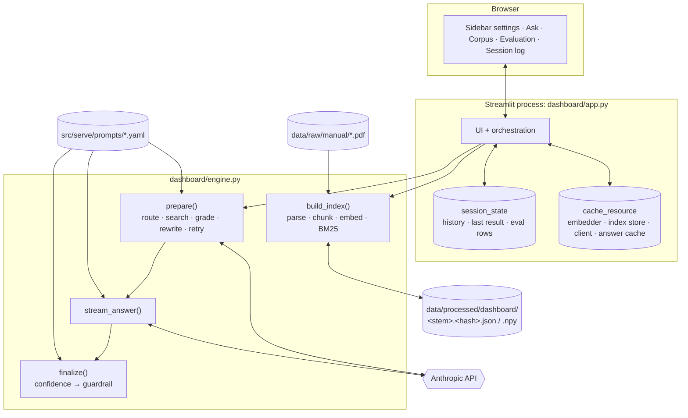
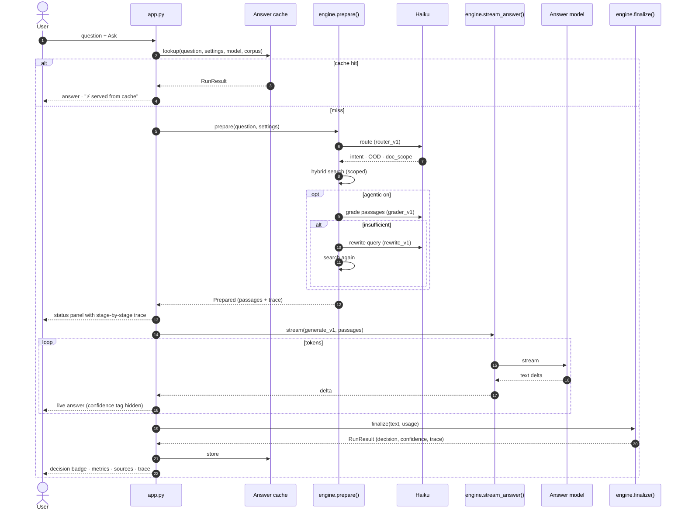

# Dashboard

`dashboard/` is a Streamlit app that runs TROA's serving lane in a single local process, with no Docker, no Qdrant, and no multi-GB models. It reuses the project's versioned prompts and guardrail thresholds, and adds hybrid search, an agentic grade-and-rewrite loop, streaming, an answer cache, and per-stage tracing.

```bash
streamlit run dashboard/app.py        # http://localhost:8501
```

Prerequisites: the corpus has been downloaded ([WORKFLOWS §2](WORKFLOWS.md#2-download-the-corpus)), `.env` holds a valid key, and the dashboard dependencies are installed ([WORKFLOWS §1](WORKFLOWS.md#1-set-up-the-environment)).

---

## Architecture



| File | Responsibility |
|---|---|
| `dashboard/engine.py` | Framework-free pipeline: indexing, BM25, hybrid search, router, grader, rewriter, streaming generation, and the guardrail. Importable and testable without Streamlit. |
| `dashboard/app.py` | Streamlit UI, caching, session state, charts, and eval scoring. |

---

## Request lifecycle (Ask tab)



---

## Sidebar settings

| Setting | Default | Effect |
|---|---|---|
| **Corpus** | All downloaded manuals | Manuals to index and search. New selections are embedded on first use; each distinct selection is a separate in-memory index. |
| **Search mode** | Hybrid | `Hybrid (BM25 + vector, RRF)`, `Vector only`, or `Keyword only (BM25)`. Use it for retrieval ablations. |
| **Passages retrieved (top-k)** | 5 | Number of passages given to the grader and generator, and the *k* in Hit@k. |
| **Router** | On | Haiku classifies intent, screens out-of-scope questions, and proposes a document scope. Off means intent `lookup`, no scope, no OOD refusal. |
| **Grade passages, rewrite query on miss** | On | Haiku grades sufficiency; on a miss it rewrites the query in RRC terminology and retrieves once more. Adds about 1–2 s on a miss. |
| **Answer cache (exact match)** | On | Re-asking an identical question with identical settings returns instantly at no cost. |
| **Answer model** | From `generate_v1.yaml` (`claude-sonnet-4-6`) | Alternatives: `claude-sonnet-5-5`, `claude-opus-5-5`, `claude-haiku-4-5-20251001`. |

The sidebar also shows the status of the API key and corpus, and the active guardrail policy.

---

## Tabs

### 💬 Ask

- A picker pre-fills questions from the eval set, or you can type your own.
- While the answer is generated, a status panel lists each stage with its duration and detail: router verdict, search mode, grader verdict and reason, and the rewritten query.
- The answer streams live. The trailing `<confidence>` tag is hidden during streaming.
- **Decision badge:** ✅ autonomous, ⚠️ caveat, ⏫ escalate, ⛔ refuse. Each pairs an icon and label with colour.
- **Metrics:** confidence, router intent, latency (or "cached"), and input/output tokens.
- If the query was rewritten, an info banner shows the new query. If the router scoped the search, a caption lists the scoped manuals.
- On escalation, the withheld draft is available in an expander for inspection.
- **Sources:** each passage shows its manual, page, vector rank, and BM25 rank. Expanding it shows cosine similarity, BM25 score, RRF score, and the full text. `[N]` in the answer refers to source N.
- **Pipeline trace:** a table of stage, seconds, and detail.

### 📚 Corpus

- KPI tiles: manuals indexed, pages with text, chunks, and keyword-vocabulary size.
- Horizontal bar chart of chunks per manual, with tooltips for description, pages, and size.
- A sortable table of all manuals.

### 🧪 Evaluation

- **Coverage:** questions per category against the `EVALUATION.md` targets, with progress bars.
- **Last harness run:** summarises `eval_data/results_latest.jsonl` and warns when every case errored.
- **Run eval:** runs every eval question with the *current sidebar settings* (2–4 API calls each) and reports:

| Tile | Definition | Target |
|---|---|---|
| Hit@k (manual) | Share of in-scope cases where any passage from a ground-truth manual is in the top-k | ≥ 0.85 |
| MRR (manual) | Mean of 1 / rank of the first ground-truth-manual passage (0 if none) | ≥ 0.55 |
| OOD refusal rate | Share of `ood` cases that were refused or escalated | ≥ 0.95 |
| In-scope refusal rate | Share of in-scope cases that were refused or escalated | ≤ 0.10 |

  A per-case table (decision, confidence, hit, rewritten, top manual, latency) can be downloaded as JSONL. Retrieval metrics use the passages actually sent to the generator, which means *after* any rewrite.

### 📈 Session log

- **Confidence vs guardrail thresholds:** one point per question, coloured by decision, with dashed lines at 0.70 and 0.85.
- **Latency by pipeline stage:** a stacked bar per question across route, retrieve, grade, rewrite, retrieve (retry), and generate. Cached answers are excluded.
- A table of every question asked in the session.

The session log lives in the browser session and is cleared on reload.

---

## Performance

Approximate timings observed on a CPU-only Windows laptop with the 35 manuals (before the Statewide Rules were added). They were not recorded systematically; the trace panel and Session log tab show real per-stage timings for your own runs. The chunk count (4,820) can be checked from `data/processed/dashboard/*.json`.

| Operation | Time |
|---|---|
| First index build (4,820 chunks, `bge-small`) | about 10 min |
| Index load from disk cache | about 1 s |
| Router call (Haiku) | about 1 s |
| Hybrid search | < 0.1 s |
| Grade + rewrite on a miss (Haiku) | about 2 s |
| Generation (Sonnet) | about 3–8 s |
| Cached answer | instant |

---

## Extending

- **Add a search mode:** extend `SEARCH_MODES` and the ranking assembly in `engine.search()`.
- **Add a pipeline stage:** wrap it with `timed()` inside `engine.prepare()`. It appears in the trace automatically. Add its name to `STAGES` in `app.py` for a stable colour in the latency chart.
- **Use a calibrator:** apply it in `engine.finalize()` where `conf = raw_conf / 100.0`.
- **Use the engine without Streamlit:**

```python
import sys; sys.path.insert(0, "dashboard")
import engine
from sentence_transformers import SentenceTransformer
import anthropic

emb = SentenceTransformer(engine.EMBED_MODEL)
index = engine.build_index(engine.list_manuals(), emb)
client = anthropic.Anthropic(api_key=engine.load_api_key())
r = engine.run("What does the P-5 organization report contain?", index, emb, client,
               model="claude-sonnet-4-6", top_k=5, mode="hybrid", use_router=True, agentic=True)
print(r.decision, r.confidence, r.answer)
```

---

## Limitations

- Retrieval uses fixed 800-character windows and `bge-small`, not the section-aware chunker or `bge-large`, so results are not directly comparable to `src/serve` numbers.
- There is no cross-encoder reranker.
- Confidence is uncalibrated (raw / 100).
- The answer cache is in memory and exact-match only, and it is lost on restart. Its key includes the prompt file contents, so prompt edits do not serve stale answers.
- There is no LLM judge in the eval tab, so answer quality (faithfulness, relevance, citations) is not scored there. Use the harness ([WORKFLOWS §5b](WORKFLOWS.md#5b-full-harness-reference-pipeline--opus-judge)).
- With 12 eval questions, metric tiles show direction only, not statistically meaningful estimates.
