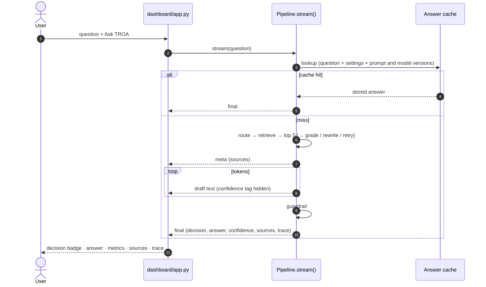

# Dashboard

`dashboard/app.py` is a browser front end for TROA. It runs the same `Pipeline` as the CLI (`ask.py`), the HTTP API, and the eval harness, over the bundled search index in `qdrant_local/`, so its answers match theirs.

```bash
streamlit run dashboard/app.py        # http://localhost:8501
```

Prerequisites: the dependencies are installed and `.env` holds a valid `ANTHROPIC_API_KEY` ([README, Quick start](../README.md#quick-start)). Nothing needs to be downloaded or built first.

On start-up the dashboard loads the embedding model (`bge-large-en-v1.5`; downloaded once, 1.34 GB) behind a spinner. Only one program can open `qdrant_local/` at a time: if `ask.py`, the API, or another dashboard has it open, the dashboard says so and stops.

---

## How a question is answered



The streamed text is the generator's draft. When the final event arrives, the dashboard replaces it with the guardrail's answer: on escalation that is the escalation notice, and the draft moves to a "withheld draft" expander.

---

## Sidebar

| Setting | Default | Effect |
|---|---|---|
| **Hybrid search** | From `TROA_SEARCH_MODE` (off) | Adds BM25 keyword search, fused with semantic search. Helps with exact form numbers such as W-10. |
| **Grade passages, retry with a rewritten query** | From `TROA_AGENTIC` (off) | A Haiku grader checks whether the passages can answer; if not, the query is rewritten and retrieval runs once more. |
| **Rerank with cross-encoder** | From `TROA_RERANK` (off) | `bge-reranker-large`; a 2.24 GB download on first use. Off keeps the top 5 by retrieval score. |
| **Answer cache (exact match)** | On | Re-asking the same question with the same settings returns the stored answer. Escalations and refusals are never cached. |

The sidebar also shows whether the API key is set, how many documents are in the index, whether a calibrator is loaded (`TROA_CALIBRATION`), and the guardrail thresholds.

---

## Tabs

### 💬 Ask

- Pick an example question from the eval set, or type your own.
- The answer streams live, then shows a **decision badge**: ✅ autonomous, ⚠️ caveat, ⏫ escalate, ⛔ refuse. Each pairs an icon and label with a colour.
- **Metrics:** confidence (hover for the raw 0–100 score), router intent, latency (or "cached"), input/output tokens.
- If the query was rewritten, a banner shows the new query. If the router narrowed the search to particular documents, a caption lists them.
- **Sources:** one expander per passage with document, page, and search ranks; inside are the section path, the score, and the full passage text. `[N]` in the answer refers to source N.
- **Pipeline trace:** each stage with its duration and detail.

### 📚 Corpus

Documents, chunks, and approximate tokens in the index, with a chart and table of chunks per document and the description from `data/download_data.py`. "Pages" is the highest page number among a document's chunks.

### 🧪 Evaluation

- **Coverage:** questions per category against the `EVALUATION.md` targets.
- **Saved harness runs:** pick any `eval_data/results_*.jsonl` to see its per-case decisions, confidence, judge scores, and retrieval hits.
- **Run eval:** runs every eval question with the current sidebar settings (no answer cache, no judge) and reports Hit@5 and MRR at document level, out-of-scope refusal rate, and in-scope refusal rate against their targets. Results download as JSONL. For answer-quality scores, use the harness with the judge (`python tasks.py eval`).

### 📈 Session log

Confidence of each question against the guardrail thresholds, latency by pipeline stage, and a table of the session's questions. The log lives in the browser session and is cleared on reload.

---

## Extending

- **Add a sidebar switch:** add the option to `Pipeline`, then pass it through `get_pipeline()` in `dashboard/app.py` (each combination of switches gets its own cached `Pipeline` sharing the heavy components built in `components()`).
- **Add a pipeline stage:** add it inside `Pipeline.prepare()` with `trace.stage(...)`; it appears in the trace and the latency chart. Add its name to `STAGES` in `app.py` for a stable colour.

---

## Limitations

- Confidence is the model's raw self-rating unless `TROA_CALIBRATION` points to a fitted calibrator.
- The eval tab has no LLM judge, so it scores retrieval and refusals, not answer correctness.
- With 12 eval questions, the metric tiles show direction only.
