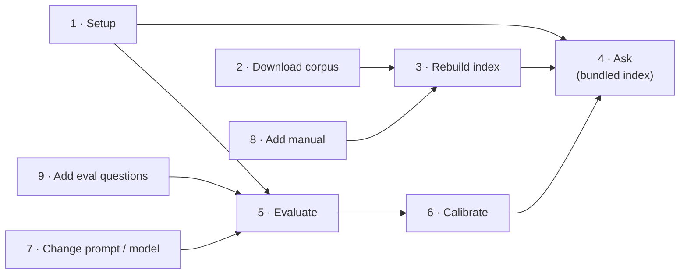
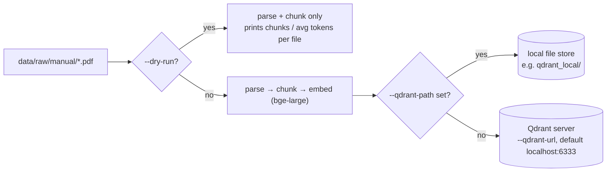
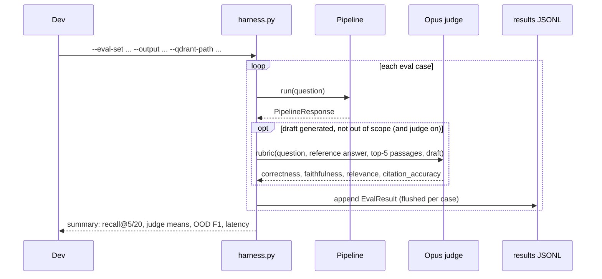
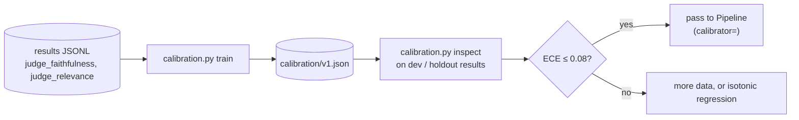
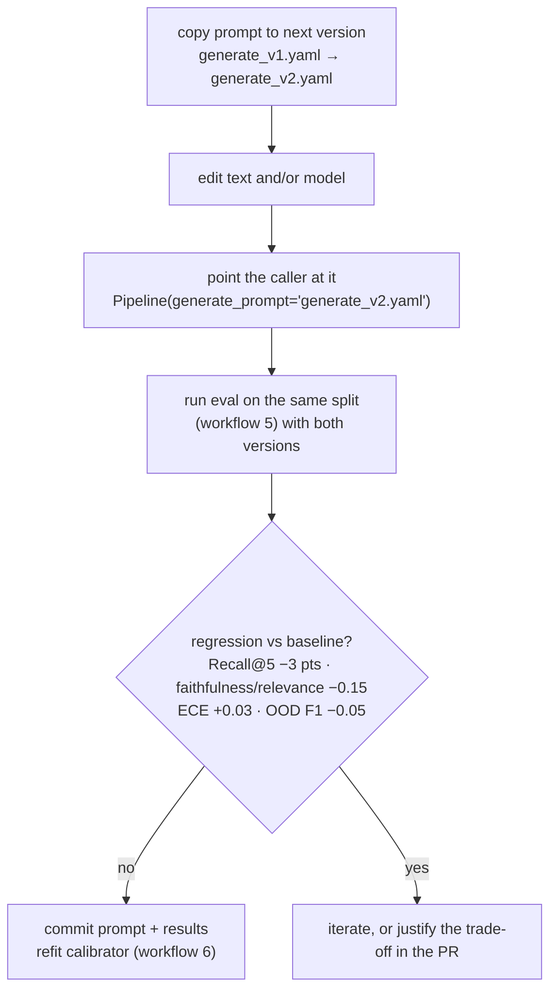

# Workflows

Step-by-step procedures for working with TROA: setup, ingestion, querying, evaluation, calibration, and change management. Each workflow lists its prerequisites, the exact commands, what to expect, and how to verify the result.

Commands are written for Git Bash or any POSIX shell. On Windows PowerShell, replace `source .venv/bin/activate` with `.venv\Scripts\Activate.ps1`, or call `.venv\Scripts\python` directly.

The most common commands also have short names in `tasks.py` (run `python tasks.py` to list them): `setup`, `ask`, `test`, `download`, `ingest-check`, `ingest`, `dashboard`, `api`, `eval-check`, `eval`, `eval-ablation`, `calibrate`, `docker-up`, `docker-down`. Extra arguments go to the underlying command.

Times and costs below are rough estimates from development use, not measurements recorded in the repository.

| # | Workflow | Time | Cost |
|---|---|---|---|
| 1 | [Set up the environment](#1-set-up-the-environment) | 5–15 min | – |
| 2 | [Download the corpus](#2-download-the-corpus) (only to rebuild the index) | 1–10 min | – |
| 3 | [Ingest the corpus into Qdrant](#3-ingest-the-corpus-into-qdrant) (only to rebuild the index) | 10–40 min (CPU) | – |
| 4 | [Ask a question](#4-ask-a-question) (CLI, dashboard, Python, HTTP API) | 5–15 s | 2 API calls / question |
| 5 | [Run the evaluation](#5-run-the-evaluation) | 2–10 min (12 questions) | ~$0.05–0.50 |
| 6 | [Fit and apply the calibrator](#6-fit-and-apply-the-calibrator) | 1 min | – |
| 7 | [Change a prompt or model](#7-change-a-prompt-or-model) | – | one eval run |
| 8 | [Add a manual to the corpus](#8-add-a-manual-to-the-corpus) | minutes | – |
| 9 | [Add evaluation questions](#9-add-evaluation-questions) | – | – |
| 10 | [Troubleshooting](#10-troubleshooting) | | |

The end-to-end lifecycle these workflows support:



---

## 1. Set up the environment

**Prerequisites:** Python 3.12 (the tested version), Git, and an Anthropic API key with credits.

```bash
git clone https://github.com/drealchux/troa.git && cd troa
python -m venv .venv
source .venv/bin/activate            # Windows PowerShell: .venv\Scripts\Activate.ps1
```

Install the dependencies:

| Use | Command |
|---|---|
| Ask questions, dashboard, API, ingestion, evaluation | `pip install -r requirements.txt` |
| Also run the tests | `pip install -r requirements-dev.txt` |

`requirements.txt` pins the versions the tests and eval runs used. On Linux without a GPU, install the CPU build of PyTorch first (`pip install torch~=2.14.1 --index-url https://download.pytorch.org/whl/cpu`), or pip downloads the much larger CUDA build.

Configure the API key:

```bash
cp .env.example .env
# edit .env and set ANTHROPIC_API_KEY=sk-ant-...
```

`.env` is git-ignored. The key must be **scoped to a workspace** and the account must have **API credits**; see [Troubleshooting](#10-troubleshooting).

**Verify:**

```bash
python -m pip check          # expect: No broken requirements found.
python -m pytest -q          # with requirements-dev.txt; expect 82 passed
```

---

## 2. Download the corpus

Not needed to ask questions: the search index built from these documents ships in `qdrant_local/`. Download them to rebuild the index (workflow 3), for example after RRC updates a document.

```bash
python data/download_data.py                  # 35 manuals + the Statewide Rules (~16 MB)
python data/download_data.py --include-data   # + structured data files
python data/download_data.py --include-all    # + imaged W-1 permits (large)
```

Files land in `data/raw/<category>/`. Existing files are skipped; use `--force` to re-download. `--workers N` controls parallelism.

**Expected:** `Done. 36/37 successful.` (35 manuals plus the Statewide Rules, `statewide_rules_16tac_ch3.pdf`.) The `oil_gas_docket` manual (`oda037k.pdf`) currently returns HTTP 404 from rrc.texas.gov. No component depends on it.

**Verify:** `ls data/raw/manual | wc -l` prints `36`.

The Statewide Rules URL changes whenever RRC amends Chapter 3. If it returns 404, take the new Chapter 3 PDF link from https://www.rrc.texas.gov/general-counsel/rules/current-rules/ and update the `statewide_rules` entry in `data/download_data.py`. Keep the filename prefix `statewide_rules`: ingestion uses it to pick the rules chunker.

---

## 3. Ingest the corpus into Qdrant

Only needed to rebuild the bundled index (`qdrant_local/`), for example after downloading updated documents or changing the chunker or embedding model.



```bash
# 1. Sanity check parsing and chunking (fast, no models)
python -m src.ingest.pipeline --corpus data/raw/manual/ --dry-run

# 2a. Ingest into a local file store (no Docker)
python -m src.ingest.pipeline --corpus data/raw/manual/ --qdrant-path qdrant_local

# 2b. ...or into a Qdrant server
docker run -p 6333:6333 qdrant/qdrant:v1.19.1     # same version as compose.yml and qdrant-client
python -m src.ingest.pipeline --corpus data/raw/manual/ --qdrant-url http://localhost:6333
```

Notes:

- The first run downloads `bge-large-en-v1.5` (about 1.34 GB).
- Re-ingesting is idempotent for unchanged chunks, because point IDs are derived from chunk IDs. After changing chunking parameters, delete the collection first, or stale chunks remain.
- The repository already contains `qdrant_local/` with 2,941 points (1024-d) from 36 documents: 1,992 manual chunks and 949 Statewide Rules chunks, exactly what this workflow produces from today's download. To rebuild from scratch, delete or move `qdrant_local/` first.
- `statewide_rules*.pdf` is chunked by rule and subsection (`src/ingest/rules.py`); every other PDF goes through the font-size parser. To add only one PDF to an existing store, point `--corpus` at a folder containing just that file; existing points are kept.
- Only one process can open a local-file Qdrant store at a time.

**Verify:** the final line reads `Collection size: N points`, and per-file failures are listed if any occurred.

---

## 4. Ask a question

All four entry points run the same `Pipeline` over the bundled index (`qdrant_local/`) unless `.env` sets `QDRANT_PATH` or `QDRANT_URL`, so they give the same answers. The first question downloads `bge-large-en-v1.5` (1.34 GB) once. Only one of them can open `qdrant_local/` at a time.

### 4a. Terminal

```bash
python ask.py "What does the Drilling Permit Master dataset contain?"
python ask.py                                  # interactive; blank line to quit
python ask.py --hybrid --agentic "When must an inactive well be plugged?"
```

It prints the guardrail decision, the answer (or the escalation notice), the confidence, and one line per source: document, page, section. `--rerank` adds the cross-encoder (2.24 GB download).

### 4b. Dashboard

```bash
streamlit run dashboard/app.py         # opens http://localhost:8501
```

Start-up takes about 20 s while the embedding model loads. See [DASHBOARD.md](DASHBOARD.md) for a full tour.

### 4c. Reference pipeline (Python)

```python
from dotenv import load_dotenv; load_dotenv()
from src.serve.pipeline import Pipeline

pipe = Pipeline(qdrant_path="qdrant_local")    # or qdrant_url="http://localhost:6333"
r = pipe.run("How often is the Statewide API Data file updated?")
print(r.answer)
print(r.intent, r.raw_confidence, r.calibrated_confidence, r.refused)
for rc in r.ranked_chunks:
    print(f"{rc.rerank_score:.2f}  {rc.chunk.doc_name}  p.{rc.chunk.page_num}")
```

The first call downloads `bge-large-en-v1.5` (1.34 GB). With `rerank=True`, the first call also downloads `bge-reranker-large` (2.24 GB); sizes are the model weights listed on the Hugging Face model pages. Without the reranker, `rerank_score` holds the retrieval score.

Optional features, all off by default (including `rerank=True`) (see [ARCHITECTURE §4](../ARCHITECTURE.md#4-serving-lane-srcserve)):

```python
from src.serve.cache import AnswerCache

pipe = Pipeline(
    qdrant_path="qdrant_local",
    search_mode="hybrid",           # BM25 + dense, fused with RRF
    agentic=True,                   # grade → rewrite → retry once
    cache=AnswerCache(),            # or AnswerCache(redis_url="redis://localhost:6379/0")
    query_log="logs/queries.jsonl",
)
r = pipe.run("When is the W-10 due?")
print(r.decision, r.retrieval_sufficient, r.search_query)
for s in r.trace:
    print(f"{s['stage']:<18} {s['seconds']:.2f}s  {s['detail']}")

for event in pipe.stream("When is the W-10 due?"):   # meta, token..., final
    ...
```

### 4d. HTTP API

Settings come from `.env` (see `.env.example`: `TROA_SEARCH_MODE`, `TROA_AGENTIC`, `TROA_RERANK`, `TROA_CALIBRATION`, `TROA_CACHE`, `REDIS_URL`, `TROA_QUERY_LOG`, `QDRANT_URL` / `QDRANT_PATH`).

```bash
# Local, on the bundled index (the default when QDRANT_PATH and QDRANT_URL are unset)
uvicorn src.api.app:app --port 8000

# Or with Docker: Qdrant server + Redis + API (ingest into the server once)
docker compose up -d qdrant redis
docker compose run --rm api python -m src.ingest.pipeline --corpus data/raw/manual
docker compose up -d api

curl localhost:8000/health
curl -X POST localhost:8000/ask -H "Content-Type: application/json" \
     -d '{"question": "When is the W-10 due?"}'
curl -N -X POST localhost:8000/ask/stream -H "Content-Type: application/json" \
     -d '{"question": "When is the W-10 due?"}'
```

`/ask` returns `decision`, `answer`, both confidences, `citations`, `agent_steps`, `trace`, and `cached`. On `/ask/stream`, the `token` events are the generator's draft. Always render `final.answer`, which replaces the draft on escalation and appends the caveat banner.

### Reading the response

| Outcome | Meaning | What to do |
|---|---|---|
| ✅ Autonomous answer | Confidence ≥ 0.85 | Use it, and spot-check the citations. |
| ⚠️ Answer with caveat | 0.70–0.85 | Verify against the cited pages before relying on it. |
| ⏫ Escalate | < 0.70, or nothing retrieved | Consult rrc.texas.gov or a compliance specialist. In the dashboard, the withheld draft can be inspected. |
| ⛔ Refuse | Router judged the question out of scope | Rephrase if it really is about RRC oil and gas regulation. |

Confidence is the model's **uncalibrated** self-report until [workflow 6](#6-fit-and-apply-the-calibrator) is completed.

---

## 5. Run the evaluation

### 5a. Quick eval in the dashboard

Open the **🧪 Evaluation** tab and click **Run eval**. It uses the current sidebar settings and scores Hit@k and MRR (document level), OOD refusal rate, and in-scope refusal rate against the `EVALUATION.md` targets. Results can be downloaded as JSONL. There is no LLM judge in this path, so the output cannot be used for calibration.

### 5b. Full harness (reference pipeline + Opus judge)



```bash
# Validate the YAML only
python -m src.eval.harness --eval-set eval_data/eval_set_sample.yaml --dry-run

# Retrieval and refusal metrics only (no judge)
python -m src.eval.harness --eval-set eval_data/eval_set_sample.yaml \
    --output eval_data/results_nojudge.jsonl --qdrant-path qdrant_local --no-judge

# Full run with the judge
python -m src.eval.harness --eval-set eval_data/eval_set_sample.yaml \
    --output eval_data/results_latest.jsonl --qdrant-path qdrant_local
```

### 5c. Ablations

Each serving option is off by default and must earn its place on the eval set. Run the baseline and one variant at a time, then compare `recall@5`, `reranked recall@5` (what the generator actually saw), escalation rate, judge scores, and latency:

```bash
python -m src.eval.harness --qdrant-path qdrant_local --output eval_data/results_vector.jsonl
python -m src.eval.harness --qdrant-path qdrant_local --output eval_data/results_hybrid.jsonl --search-mode hybrid
python -m src.eval.harness --qdrant-path qdrant_local --output eval_data/results_hybrid_agentic.jsonl --search-mode hybrid --agentic
python -m src.eval.harness --qdrant-path qdrant_local --output eval_data/results_vector_rerank.jsonl --rerank
```

Every result line records its `settings`, `decision`, `search_query`, and `retrieval_sufficient`. With `--agentic`, compare `retrieval_sufficient` against judge correctness: if it separates right from wrong answers, it is a candidate calibration feature (known gap #8).

**Check the output before trusting it.** Every line has an `error` field. If all cases errored (as in the committed `results_latest.jsonl`, which failed with `401 invalid x-api-key`), the summary metrics are `nan` and meaningless.

```bash
python -c "import json; r=[json.loads(l) for l in open('eval_data/results_latest.jsonl')]; print(sum(bool(x['error']) for x in r), 'errors of', len(r))"
```

---

## 6. Fit and apply the calibrator

**Prerequisite:** a harness run **with the judge** (5b) on the *train* split. The calibrator needs a mix of correct and incorrect answers. A case counts as correct when `correctness == 2 and faithfulness == 2`: the draft gives the reference answer's information and makes nothing up. Escalated drafts are judged too. Results from before 2026-10-08 have no `judge_correctness` and are skipped. `train` warns when there are fewer than 100 examples, or none below raw confidence 70; treat such a fit as a smoke test.



**Step 1: train and inspect.** A subcommand is required. `train` reads the harness's `judge_faithfulness` / `judge_relevance` fields directly (plain `faithfulness` / `relevance` also work). It skips records that errored or were not judged and prints how many it skipped:

```bash
python -m src.eval.calibration train   --results eval_data/results_latest.jsonl --output calibration/v1.json
python -m src.eval.calibration inspect --inspect calibration/v1.json --results <dev-split results>.jsonl
```

`train` prints raw versus calibrated ECE, Brier score, and reliability tables, and warns if calibration made things worse. `inspect` warns when ECE is above 0.08.

**Step 2: apply it.** `Pipeline` calls `calibrator.predict_proba(raw_0_to_100)`, which is the method `CalibrationModel` provides, so pass the loaded model directly:

```python
import json
from src.eval.calibration import CalibrationModel
from src.serve.pipeline import Pipeline

with open("calibration/v1.json", encoding="utf-8") as f:
    cal = CalibrationModel.from_json(json.load(f))

pipe = Pipeline(qdrant_path="qdrant_local", calibrator=cal)
```

To evaluate with it, pass `--calibration calibration/v1.json` to the harness. To serve with it, set `TROA_CALIBRATION=calibration/v1.json` for the API. The dashboard does not load a calibrator yet.

---

## 7. Change a prompt or model

Prompts are versioned files. Never edit a prompt that a reported result depends on; add a new version.



- The regression limits are the CI gates from `EVALUATION.md`. CI is not automated yet, so apply them by hand.
- A generator prompt or model change **invalidates the calibrator**, because the raw confidence distribution shifts. Refit it.
- The dashboard reads the model default from `generate_v1.yaml` and lets you override it in the sidebar. Its answer-cache key includes the prompt file contents, so a prompt edit does not serve stale answers.

---

## 8. Add a manual to the corpus

1. Add a `Dataset(...)` entry to `MANUALS` in `data/download_data.py` (name, `category="manual"`, url, filename, description), then run `python data/download_data.py`. Alternatively, drop the PDF into `data/raw/manual/`.
2. **Dashboard:** restart, or select the manual in the sidebar corpus picker. It is embedded on first use and cached. The description shows in the Corpus tab if it is listed in `download_data.py`.
3. **Qdrant:** re-run ingestion (workflow 3). Unchanged manuals are re-upserted idempotently.
4. Add eval questions that target the new manual (workflow 9), so its retrieval quality is measured.

Scanned PDFs without a text layer yield no chunks, because OCR is not implemented. Check the Corpus tab or the ingestion output for zero-chunk files.

---

## 9. Add evaluation questions

Append to `eval_data/eval_set_sample.yaml` (or a new versioned eval file):

```yaml
  - id: sdf-004                       # category prefix + sequence: sdf, mds, pro, def, ood
    category: single_doc_factual      # single_doc_factual | multi_doc_synthesis | procedural | definitional | ood
    difficulty: 2                     # 1 easy · 2 medium · 3 hard
    question: "..."
    ground_truth_answer: "1–3 sentences a correct answer must contain."
    ground_truth_chunks:              # [] for ood
      - document: "ola001k_oil_well_status_w10.pdf"   # exact filename in data/raw/manual/
        section: "Filing requirements"
    notes: "Why this question is in the set; what makes it hard."
```

Rules:

- `document` must match a downloaded filename exactly; both the harness and the dashboard match on it.
- Write the ground truth **from the manual**, not from memory, and confirm the answer actually exists in the corpus. Questions the corpus cannot answer measure refusal behaviour, not retrieval.
- Keep the category mix close to the `EVALUATION.md` targets (50 / 50 / 40 / 40 / 20).
- Run `python -m src.eval.harness --eval-set <file> --dry-run` to validate.

---

## 10. Troubleshooting

| Symptom | Cause | Fix |
|---|---|---|
| `ANTHROPIC_API_KEY not found` | No `.env`, or the placeholder value is still there | Put a real key in `.env` (workflow 1). |
| `400 … API key is not scoped to a workspace … anthropic-workspace-id header` | Organisation-level key | Create the key inside a workspace (Console → Settings → Workspaces), or send the `anthropic-workspace-id` header. |
| `400 … credit balance is too low` | No API credits; Claude.ai subscriptions are billed separately | Console → Settings → Billing → buy credits. Allow a minute to propagate. |
| `401 invalid x-api-key` | Wrong or revoked key | Replace the key. |
| Hugging Face "symlinks not supported" warning (Windows) | Windows without Developer Mode | Harmless. Set `HF_HUB_DISABLE_SYMLINKS_WARNING=1`, or enable Developer Mode. |
| `ModuleNotFoundError` for any package | Dependencies not installed in the active environment | Activate `.venv` and run `pip install -r requirements.txt`; `python -m pip check` should report no broken requirements. |
| Dashboard says it could not open the search index | Another program (`ask.py`, the API, another dashboard) has `qdrant_local/` open | Close it and reload the page. |
| Qdrant "storage folder is already accessed by another instance" | Two processes opened the same `--qdrant-path` | Close the other process, or use a Qdrant server. |
| Answer for a scoped question draws on the wrong manual | The router's `doc_scope` resolved to nothing, so the search fell back to the whole corpus | Check `PipelineResponse.doc_scope` (`None` = whole corpus). Matching rules are in `src/serve/scope.py`. |
| `calibration.py: error: argument cmd` | Subcommand missing | Use `calibration train …` or `calibration inspect …`. |
| `Cannot fit calibration: training labels are all the same class` | Too few judged results (errored or `--no-judge` runs are skipped) | Run more cases with the judge enabled. |
| Dashboard shows an old answer | Answer cache (exact match; the key includes question, settings, model, selected manuals, and prompt contents) | Toggle the cache off, or restart Streamlit. |
| First `Pipeline` call or harness run sits on "Loading…" for a long time, and no results are written | `bge-reranker-large` (2.24 GB) is still downloading. An interrupted download leaves `*.incomplete` files under `~/.cache/huggingface/hub/models--BAAI--bge-reranker-large/blobs/` and does not count as installed | Let the download finish once, or run without the reranker (the default: drop `--rerank`, or set `TROA_RERANK=false`). Check that no `*.incomplete` files remain; delete stale ones to reclaim space. |
| Machine runs out of memory or freezes during chunking | Before 2026-10-08, `_split_with_overlap` could loop forever when the overlap was not smaller than the window | Fixed in `src/ingest/chunk.py`; update to the current code. See ARCHITECTURE §12. |
